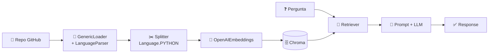

<h1 align="center">🔍 Introdução e Setup do Projeto - Introdução</h1>

  
  
  

<h2 align="left">📌 Projeto: RAG Code Review</h2>

Em vez de um PDF, a base de conhecimento agora é um **repositório de código** (o próprio `langchain_core`). O RAG busca os trechos relevantes do código e o LLM responde perguntas / faz review sobre eles.

| | RAG PDF (aulas 172–178) | RAG Code Review |
| :--- | :--- | :--- |
| Fonte | `documento.pdf` | Repo clonado com `GitPython` |
| Loader | `PyPDFLoader` | `GenericLoader` + `LanguageParser` |
| Splitter | Por caracteres | **Ciente da linguagem** (classes, funções) |
| Chain | LCEL manual | `create_retrieval_chain` + `create_stuff_documents_chain` |

> 💡 Código não se divide bem por número de caracteres: cortar no meio de uma função perde o sentido. Por isso o splitter usa a sintaxe da linguagem.

---

## ✅ Resumo

- Mesmo fluxo RAG, trocando a fonte de dados por código-fonte.
- Ambiente: **Jupyter Notebook** (`Code-Review-RAG.ipynb`) — aqui replicado em `.py`.
