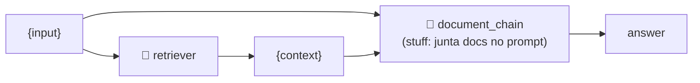

<h1 align="center">⛓️ Desenvolvendo a Solução - Construindo o prompt e a chain</h1>

<p align="center">
  
  
  
</p>

<h2 align="left">🧠 LLM</h2>

```python
llm = ChatOpenAI(model="gpt-4o-mini", max_tokens=200)
```

> 💡 O vídeo usa `gpt-3.5-turbo`; aqui mantenho o `gpt-4o-mini` das aulas anteriores. `max_tokens=200` limita o tamanho da resposta.

---

## 📝 Prompt

```python
prompt = ChatPromptTemplate.from_messages(
    [
        (
            "system",
            "Você é um revisor de código experiente. Forneça informações detalhadas sobre "
            "a revisão do código e sugestões de melhorias baseado no contexto fornecido abaixo: \n\n{context}",
        ),
        ("user", "{input}"),
    ]
)
```

| Papel | Conteúdo |
| :--- | :--- |
| `system` | Persona (revisor de código) + `{context}` com os chunks recuperados |
| `user` | `{input}` — a pergunta |

---

## ⛓️ Chains

```python
document_chain = create_stuff_documents_chain(llm, prompt)
retrieval_chain = create_retrieval_chain(retriever, document_chain)

response = retrieval_chain.invoke({"input": "Você pode revisar e sugerir melhorias para o código de RunnableBinding?"})
response["answer"]
```



| Chain | Função |
| :--- | :--- |
| `create_stuff_documents_chain` | Junta ("stuff") todos os docs em `{context}` e chama o LLM |
| `create_retrieval_chain` | Busca os docs com o retriever e passa para a `document_chain` |

Saída: dict com `input`, `context` (lista de `Document`) e `answer`.

> 💡 Equivale ao LCEL manual da aula 175 (`{"context": retriever | formatar_docs, "question": ...} | prompt | llm`), só que pronto.

---

## ✅ Resumo

- Prompt com `system` (persona + contexto) e `user` (pergunta).
- `create_retrieval_chain(retriever, create_stuff_documents_chain(llm, prompt))` = RAG completo.
- Código: [184-...Construindo o prompt e a chain.py](184-Desenvolvendo%20a%20Solução%20-%20Construindo%20o%20prompt%20e%20a%20chain.py)
