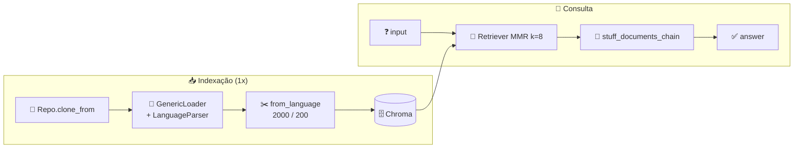

<h1 align="center">🏁 Validação e Desafios do RAG - Response e Recapitulando</h1>

<p align="center">
  
  
  
</p>

<h2 align="left">💬 Response</h2>

```python
response = retrieval_chain.invoke({"input": "Você pode revisar e sugerir melhorias para o código de RunnableBinding?"})
print(response["answer"])
```

| Chave | Conteúdo |
| :--- | :--- |
| `input` | A pergunta enviada |
| `context` | Lista de `Document` recuperados pelo retriever (8, via MMR) |
| `answer` | Review gerado pelo LLM com base no `context` |

> 💡 Olhar `response["context"]` mostra **de quais arquivos** veio a resposta — útil para validar se o retriever trouxe o código certo.

---

## 📌 Fluxo completo



| Aula | Etapa | Função |
| :---: | :--- | :--- |
| 181 | Clonar e carregar código | `clonar_repo` / `carregar_codigo` |
| 182 | Chunks por linguagem | `separar_chunks` |
| 183 | Banco vetorial + retriever | `preparar_base` / `criar_retriever` |
| 184 | Prompt + chains | `criar_chain` |
| 185 | Execução | `revisar` |

---

## ▶️ Rodar

```bash
python "185-Validação e Desafios do RAG - Response e Recapitulando.py"
```

---

## ✅ Resumo

- `retrieval_chain.invoke({"input": ...})` → `answer` + `context` (fontes).
- Mesmo RAG do PDF, adaptado para código: loader, splitter e retriever trocados.
- Código: [185-...Response e Recapitulando.py](185-Validação%20e%20Desafios%20do%20RAG%20-%20Response%20e%20Recapitulando.py)
