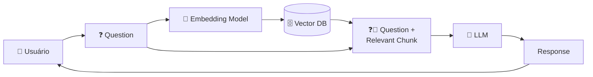

<h1 align="center">⚠️ Validação e Desafios do RAG - Desafios e Limitações do RAG</h1>

  
  
  

<h2 align="left">📌 Onde o RAG pode falhar</h2>

---

## 1️⃣ Tamanho dos chunks e número de documentos

| Parâmetro | Muito pequeno | Muito grande |
| :--- | :--- | :--- |
| `chunk_size` | Trecho sem contexto (função cortada) | Muito ruído, embedding "diluído" |
| `k` (docs recuperados) | Falta informação para responder | Contexto longo, caro e confuso para o LLM |

> ⚠️ **Não existe regra ideal** — depende dos dados e das perguntas. Os valores (2000/200, `k=8`) são ajustados por tentativa e avaliação.

---

## 2️⃣ Conhecimento de mundo

O LLM já sabe muita coisa do treino. Ele pode:

- **Misturar** o conhecimento próprio com o contexto e responder algo que não está no documento;
- **Ignorar** o contexto quando ele contradiz o que "aprendeu" (ex.: versão antiga de uma lib).

> 💡 Mitigação: prompt explícito ("use apenas o contexto", como na aula 175) e checar as fontes em `response["context"]`.

---

## 3️⃣ Perda de informação

Cada etapa descarta algo, e as perdas se acumulam:

| Etapa | O que se perde |
| :--- | :--- |
| Chunking | Relações entre partes do documento separadas em chunks diferentes |
| Embedding | O texto vira um vetor — nuances e detalhes somem |
| Retrieval | Chunks relevantes que não ficaram entre os `k` mais próximos |
| LLM | Informação do contexto ignorada ou resumida errado |

---

## 🚀 Próximo passo

Novas arquiteturas surgem para atacar esses problemas — tema do módulo **RAG Avançado**.

---

## ✅ Resumo

- Desafios: **tamanho dos chunks / `k`**, **conhecimento de mundo** do LLM e **perda de informação** no pipeline.
- Sem configuração universal: é preciso testar e avaliar.
