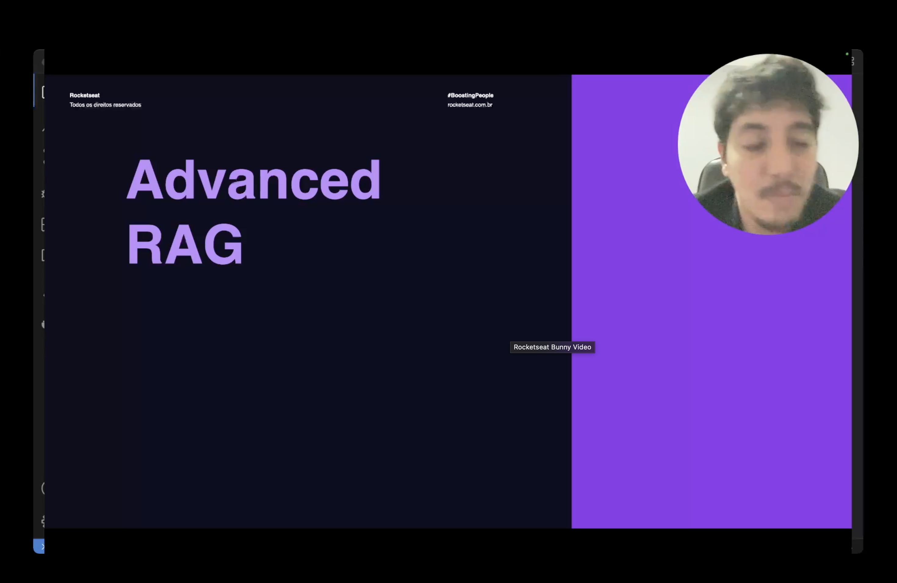
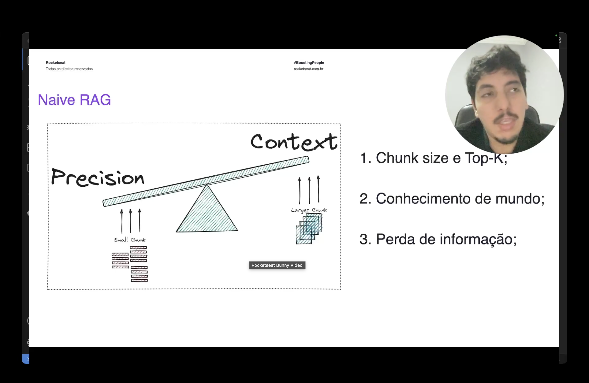
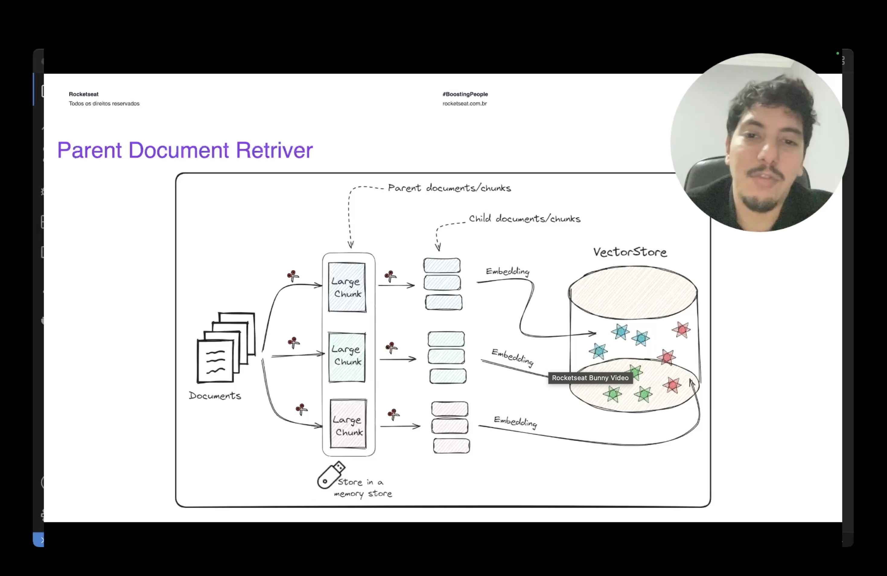
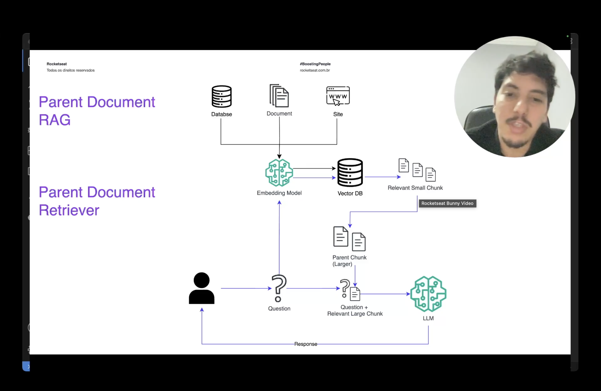
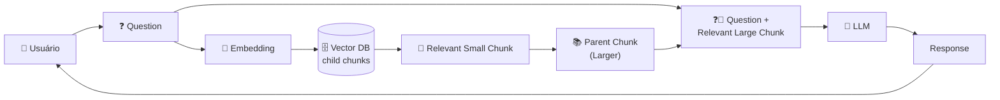

<h1 align="center">👨‍👧 Parent Rag - Introdução ao Parent Document Retriever</h1>

  
  
  

<h2 align="left">⚠️ Revisão: limites do Naive RAG</h2>

1. **Chunk size e Top-K**
2. **Conhecimento de mundo**
3. **Perda de informação**

O **Advanced RAG** reúne técnicas que atacam esses pontos. A primeira: **Parent Document Retriever**.

---

## ⚖️ Precision × Context

| Chunk | Embedding | Contexto para o LLM |
| :--- | :--- | :--- |
| **Pequeno** | Preciso: o vetor representa uma ideia só | Pobre: trecho sem o entorno |
| **Grande** | Diluído: muitas ideias em um vetor | Rico: o LLM vê o trecho completo |

> 💡 No Naive RAG o **mesmo** chunk serve para buscar e para responder, então é preciso escolher um lado. O Parent RAG separa as duas coisas.

---

## 🧩 Como funciona

1. Documentos → **parent chunks** (grandes) → guardados em um **memory store** (texto, por id).
2. Cada parent → **child chunks** (pequenos) → **embedding** → **VectorStore**, com o id do parent nos metadados.

> 🎯 **Busca com o filho (precisão), responde com o pai (contexto).**

---

## ✅ Resumo

- Naive RAG: um chunk só para busca e resposta → trade-off precisão × contexto.
- Parent RAG: **child** pequeno no vector DB para a busca; **parent** grande no docstore vai para o LLM.
