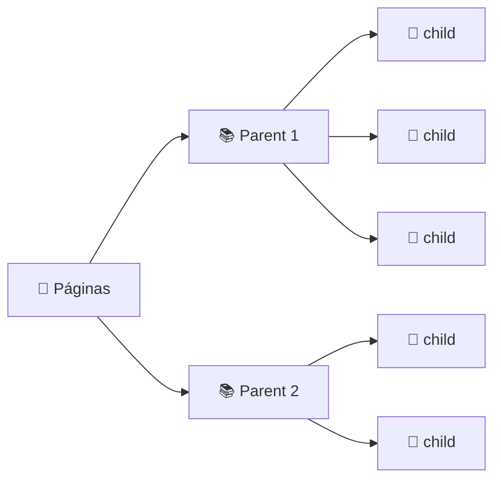

<h1 align="center">✂️ Parent Rag - Separando em Child e Parent Chunks</h1>

<p align="center">
  
  
  
</p>

<h2 align="left">🔪 Dois splitters</h2>

```python
parent_splitter = RecursiveCharacterTextSplitter(chunk_size=4000, chunk_overlap=200)
child_splitter = RecursiveCharacterTextSplitter(chunk_size=400, chunk_overlap=50)
```

| Splitter | Tamanho | Vai para | Papel |
| :--- | :---: | :--- | :--- |
| `parent_splitter` | grande (4000) | `InMemoryStore` | **Contexto** entregue ao LLM |
| `child_splitter` | pequeno (400) | Vector store (embedding) | **Busca** precisa |



---

## 👀 Conferindo a proporção

```python
parents = parent_splitter.split_documents(documentos)
children = child_splitter.split_documents(parents)
print(f"{len(parents)} parent chunks | {len(children)} child chunks")
```

> 💡 Não é preciso dividir na mão: o `ParentDocumentRetriever` (próxima aula) aplica os dois splitters sozinho no `add_documents`. Aqui é só para entender os números.
>
> ⚠️ Os valores 4000/400 são um ponto de partida. A regra é **child bem menor que parent**.

---

## ✅ Resumo

- Parent = grande (contexto) · Child = pequeno (busca).
- Código: [190-...Child e Parent Chunks.py](190-Parent%20Rag%20-%20Separando%20em%20Child%20e%20Parent%20Chunks.py)
