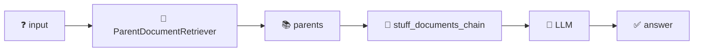

<h1 align="center">📝 Parent Rag - Construindo o prompt e chain</h1>

<p align="center">
  
  
  
</p>

<h2 align="left">💬 Prompt</h2>

```python
prompt = ChatPromptTemplate.from_messages(
    [
        (
            "system",
            "Você é um assistente que responde perguntas sobre um documento. "
            "Use apenas o contexto abaixo. Se a resposta não estiver nele, diga que não encontrou no documento.\n\n{context}",
        ),
        ("user", "{input}"),
    ]
)
```

| Variável | Preenchida por |
| :--- | :--- |
| `{context}` | Parents recuperados (via `create_stuff_documents_chain`) |
| `{input}` | Pergunta do usuário |

---

## 🔗 Chain

```python
def criar_chain(retriever):
    document_chain = create_stuff_documents_chain(llm, prompt)
    return create_retrieval_chain(retriever, document_chain)
```



> 💡 A chain é **igual** à da aula 184. Só o retriever mudou, então o Parent RAG entra no lugar do retriever comum sem mexer no resto.

---

## ✅ Resumo

- Prompt com `{context}` + `{input}`; chain = `create_stuff_documents_chain` + `create_retrieval_chain`.
- Código: [192-...Construindo o prompt e chain.py](192-Parent%20Rag%20-%20Construindo%20o%20prompt%20e%20chain.py)
