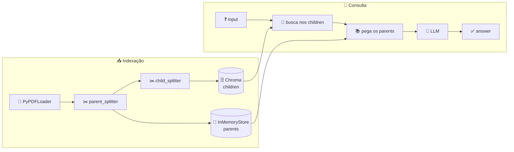

<h1 align="center">🏁 Parent Rag - Response e Conclusão</h1>

<p align="center">
  
  
  
</p>

<h2 align="left">💬 Response</h2>

```python
def perguntar(chain, pergunta: str):
    response = chain.invoke({"input": pergunta})
    paginas = sorted({doc.metadata.get("page", 0) + 1 for doc in response["context"]})
    print(f"{len(response['context'])} parents | páginas: {paginas}")
    return response["answer"]
```

| Chave | Conteúdo |
| :--- | :--- |
| `input` | A pergunta |
| `context` | **Parents** recuperados (chunks grandes) |
| `answer` | Resposta do LLM |

---

## 📌 Fluxo completo



| Aula | Etapa | Função |
| :---: | :--- | :--- |
| 189 | Carregar PDF | `carregar_pdf` |
| 190 | Parent / child splitters | `parent_splitter` / `child_splitter` |
| 191 | Retriever | `criar_parent_retriever` |
| 192 | Prompt + chain | `criar_chain` |
| 193 | Execução | `perguntar` |

---

## ⚖️ Naive RAG × Parent RAG

| | Naive RAG | Parent RAG |
| :--- | :--- | :--- |
| Chunk da busca | O mesmo que vai ao LLM | **Child** (pequeno) |
| Chunk do contexto | O mesmo da busca | **Parent** (grande) |
| Armazenamento | Vector DB | Vector DB + docstore |
| Custo | Menor | Prompt maior (mais tokens) |

> ⚠️ Não resolve tudo: o "conhecimento de mundo" do LLM continua, e os tamanhos de parent/child ainda precisam ser ajustados.

---

## ▶️ Rodar

```bash
python "193-Parent Rag - Response e Conclusão.py"
```

---

## ✅ Resumo

- Mesma chain, retriever trocado: busca precisa com o **child**, contexto rico com o **parent**.
- Ataca o trade-off **precision × context** do Naive RAG.
- Código: [193-...Response e Conclusão.py](193-Parent%20Rag%20-%20Response%20e%20Conclusão.py)
