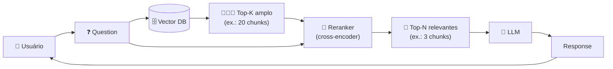

<h1 align="center">🗜️ Compressor Rag (Rerank) - Introdução ao Compressor (Rerank)</h1>

  
  
  

<h2 align="left">⚠️ O problema do Top-K</h2>

A busca vetorial compara **vetores** (pergunta × chunk) gerados separadamente. É rápida, mas aproximada:

- Chunks relevantes podem ficar **fora** dos `k` primeiros;
- `k` alto traz **ruído** e prompt caro; `k` baixo **perde** informação (aula 186).

---

## 🧩 Como funciona

Duas etapas: **recuperar muito** (barato) e depois **filtrar/reordenar** (preciso).

| Etapa | Modelo | Como compara | Custo |
| :--- | :--- | :--- | :--- |
| **Retrieval** | Embedding (bi-encoder) | Pergunta e chunk viram vetores **separados** | Baixo, escala para milhões |
| **Rerank** | Cross-encoder (ex.: Cohere Rerank) | Lê pergunta **+** chunk **juntos** e dá um score | Alto, só para poucos chunks |

> 🎯 **Busca ampla para não perder nada, rerank para mandar só o melhor ao LLM.**

---

## 🗜️ Por que "Compressor"?

No LangChain o rerank é um **document compressor**: recebe os documentos recuperados e devolve **menos** documentos (os mais relevantes). O `ContextualCompressionRetriever` junta:

- um **base retriever** (o retriever comum do Chroma);
- um **compressor** (o `CohereRerank`).

---

## ✅ Resumo

- Naive RAG: a ordem da busca vetorial decide o que vai ao LLM.
- Rerank RAG: recupera **muitos** chunks e um cross-encoder escolhe os **N melhores**.
- Menos ruído no prompt, mais precisão, sem perder recall.
