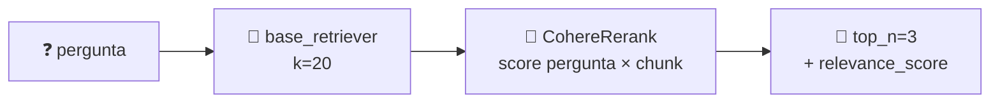

<h1 align="center">🏅 Compressor Rag (Rerank) - Método de Rerank retriever</h1>

<p align="center">
  
  
  
</p>

<h2 align="left">🧱 Montando o retriever</h2>

```python
def criar_rerank_retriever(vectorstore):
    base_retriever = vectorstore.as_retriever(search_kwargs={"k": 20})  # busca ampla
    compressor = CohereRerank(model="rerank-v3.5", top_n=3)             # fica com os 3 melhores
    return ContextualCompressionRetriever(
        base_retriever=base_retriever,
        base_compressor=compressor,
    )
```

| Peça | Parâmetro | Função |
| :--- | :--- | :--- |
| `base_retriever` | `k=20` | Recupera **muitos** candidatos (recall) |
| `CohereRerank` | `model="rerank-v3.5"` | Cross-encoder multilíngue (funciona em PT-BR) |
| `CohereRerank` | `top_n=3` | Quantos chunks seguem para o LLM (precisão) |
| `ContextualCompressionRetriever` | `base_retriever` + `base_compressor` | Encadeia busca → rerank |

---

## ⚙️ O que acontece no `invoke`



```python
vectorstore.similarity_search(pergunta, k=3)  # ordem só pela distância dos vetores
retriever.invoke(pergunta)                    # ordem do reranker, com metadata["relevance_score"]
```

> ⚠️ Cada `invoke` faz **uma chamada à API da Cohere** com os 20 chunks. A trial key tem limite por minuto; em produção, ajuste `k` para equilibrar custo e recall.
>
> 💡 Sem API externa, dá para trocar o compressor por um cross-encoder local (`FlashrankRerank` ou `CrossEncoderReranker` com HuggingFace). O resto do código não muda.

---

## ✅ Resumo

- `ContextualCompressionRetriever` = base retriever (`k` alto) + compressor (`CohereRerank`, `top_n` baixo).
- Os documentos voltam com `metadata["relevance_score"]`.
- Código: [198-...Método de Rerank retriever.py](198-Compressor%20Rag%20(Rerank)%20-%20Método%20de%20Rerank%20retriever.py)
