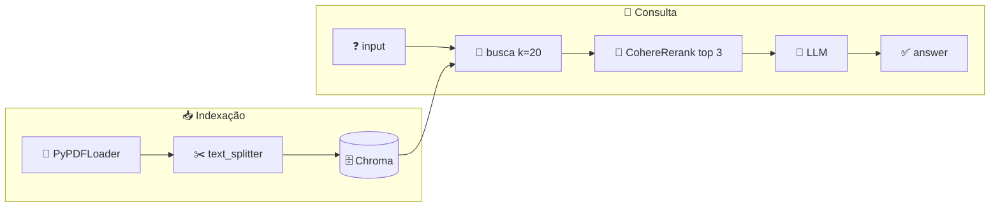

<h1 align="center">🏁 Compressor Rag (Rerank) - Response e Conclusão</h1>

<p align="center">
  
  
  
</p>

<h2 align="left">💬 Response</h2>

```python
def perguntar(chain, pergunta: str):
    response = chain.invoke({"input": pergunta})
    for doc in response["context"]:
        print(f"  pág. {doc.metadata.get('page', 0) + 1} | score {doc.metadata['relevance_score']:.3f}")
    return response["answer"]
```

| Chave | Conteúdo |
| :--- | :--- |
| `input` | A pergunta |
| `context` | Os `top_n` chunks após o rerank, com `relevance_score` |
| `answer` | Resposta do LLM |

---

## 📌 Fluxo completo



| Aula | Etapa | Função |
| :---: | :--- | :--- |
| 196 | Carregar PDF | `carregar_pdf` |
| 197 | Chunks + Chroma | `text_splitter` |
| 198 | Retriever com rerank | `criar_rerank_retriever` |
| 199 | Prompt + chain | `criar_chain` |
| 200 | Execução | `perguntar` |

---

## ⚖️ Naive × Parent × Rerank

| | Naive RAG | Parent RAG | Rerank RAG |
| :--- | :--- | :--- | :--- |
| Ataca | — | Precision × context | Ordem/ruído do Top-K |
| Busca | Vetorial | Vetorial nos **children** | Vetorial com `k` alto |
| Pós-busca | — | Troca child → **parent** | **Cross-encoder** reordena e corta |
| Vai ao LLM | `k` chunks | Parents (grandes) | `top_n` chunks mais relevantes |
| Custo extra | — | Prompt maior + docstore | Chamada ao reranker por pergunta |

> 💡 As técnicas se combinam: dá para usar um `ParentDocumentRetriever` como `base_retriever` do `ContextualCompressionRetriever`.
>
> ⚠️ O rerank melhora a **seleção**, mas não recupera o que a busca vetorial não trouxe nos `k` candidatos, e o "conhecimento de mundo" do LLM continua.

---

## ▶️ Rodar

```bash
python "200-Compressor Rag (Rerank) - Response e Conclusão.py"
```

---

## ✅ Resumo

- Mesma chain, retriever trocado: busca ampla no Chroma + rerank com cross-encoder.
- O LLM recebe poucos chunks, e os mais relevantes de verdade.
- Código: [200-...Response e Conclusão.py](200-Compressor%20Rag%20(Rerank)%20-%20Response%20e%20Conclusão.py)
