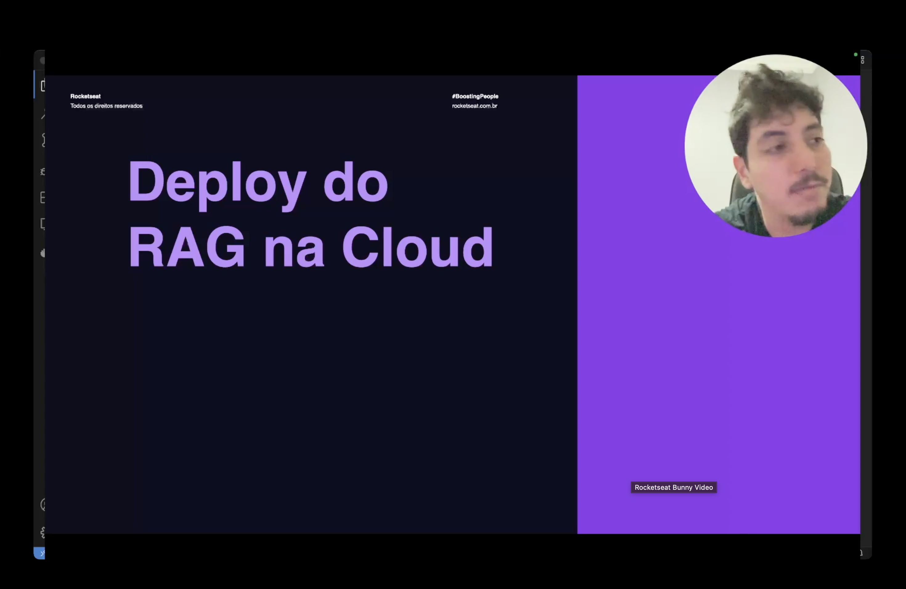
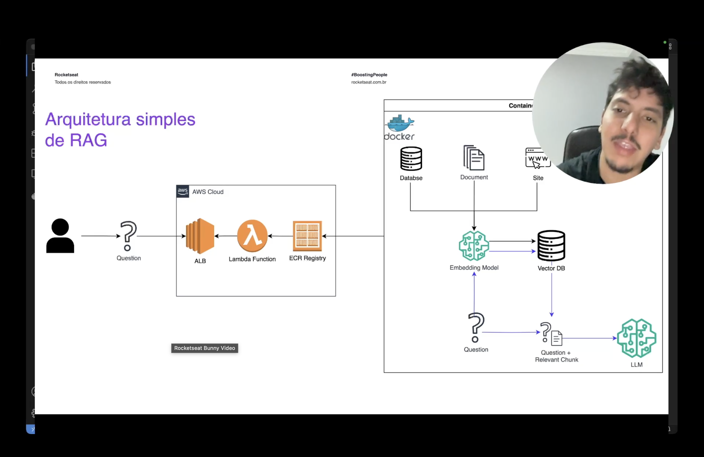
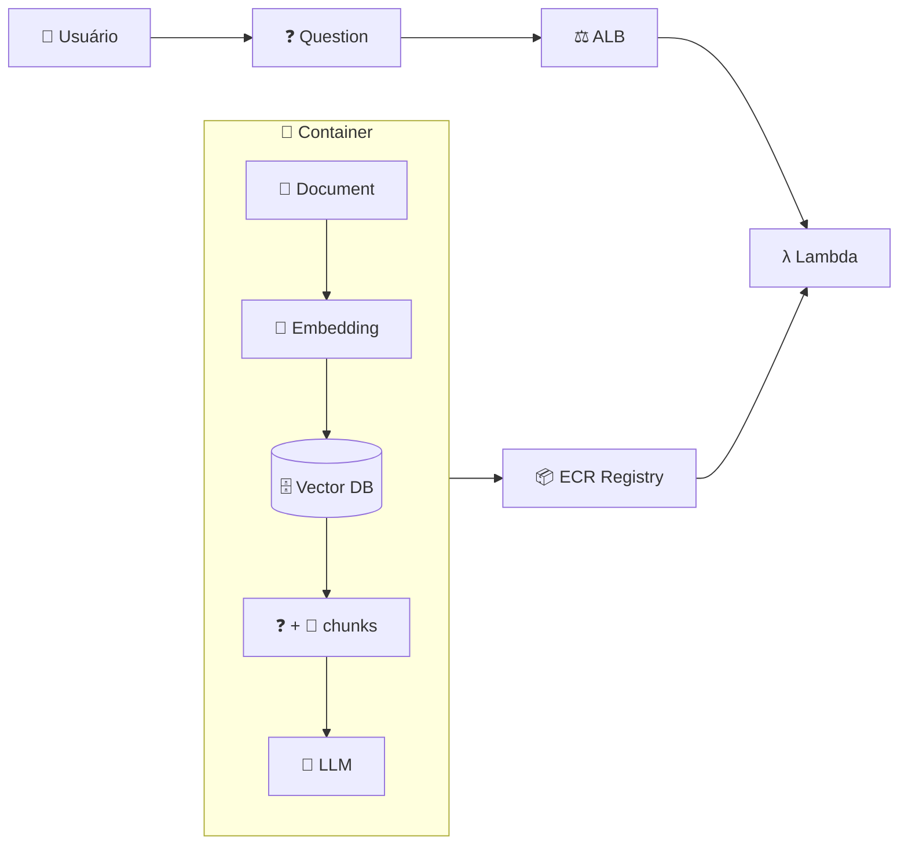

<h1 align="center">☁️ Deploy Rag - Introdução</h1>

  
  
  

<h2 align="left">🎯 Objetivo</h2>

Tirar o RAG do notebook/terminal e expor como uma **API na AWS**: o usuário manda uma pergunta via HTTP e recebe a resposta do LLM.

---

## 🏗️ Arquitetura simples de RAG

| Peça | Papel |
| :--- | :--- |
| **Docker** | Empacota código + libs + documento numa imagem |
| **ECR** | Registry onde a imagem fica guardada na AWS |
| **Lambda** | Roda o container sob demanda (serverless) |
| **ALB** | Recebe o HTTP e repassa para a Lambda |

---

## 🗺️ Roteiro

| Aula | Etapa |
| :---: | :--- |
| 202 | Notebook → `app.py` com funções de load |
| 203 | Função `response` |
| 204 | `lambda_handler` |
| 205 | `requirements.txt` + `Dockerfile` |
| 206 | AWS CLI |
| 207 | Push da imagem para o ECR |
| 208 | Lambda a partir da imagem |
| 209 | API com ALB |
| 210 | Chamada da API |

> ⚠️ Esboço: os passos de AWS ficam documentados, sem deploy real.

---

## ✅ Resumo

- RAG vira um container Docker, publicado no ECR e executado pela Lambda.
- O ALB expõe a Lambda como endpoint HTTP.
