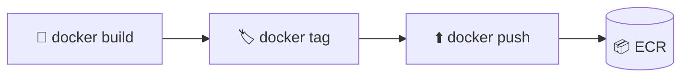

<h1 align="center">📦 Deploy Rag - Push da imagem Docker para AWS ECR</h1>

<p align="center">
  
  
  
</p>

<h2 align="left">🗂️ Variáveis</h2>

```bash
export AWS_REGION=us-east-1
export AWS_ACCOUNT_ID=$(aws sts get-caller-identity --query Account --output text)
export ECR_URI=$AWS_ACCOUNT_ID.dkr.ecr.$AWS_REGION.amazonaws.com
```

---

## 🚀 Passo a passo

```bash
# 1. Criar o repositório
aws ecr create-repository --repository-name deploy-rag --region $AWS_REGION

# 2. Login do Docker no ECR
aws ecr get-login-password --region $AWS_REGION \
  | docker login --username AWS --password-stdin $ECR_URI

# 3. Build (amd64, mesmo no Mac M1/M2) e tag
docker build --platform linux/amd64 --provenance=false -t deploy-rag .
docker tag deploy-rag:latest $ECR_URI/deploy-rag:latest

# 4. Push
docker push $ECR_URI/deploy-rag:latest
```



> ⚠️ `--platform linux/amd64` e `--provenance=false` evitam imagem multi-arch/manifest que a Lambda não aceita.

---

## ✅ Resumo

- Imagem publicada em `$ECR_URI/deploy-rag:latest`, pronta para a Lambda.
