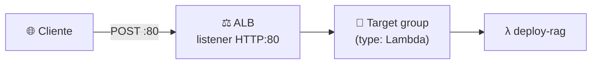

<h1 align="center">⚖️ Deploy Rag - Configurando API com ALB (EC2)</h1>

  
  
  

<h2 align="left">🎯 Por que ALB</h2>

A Lambda sozinha não tem URL pública. O **Application Load Balancer** (console do **EC2**) recebe o HTTP e encaminha para um **target group do tipo Lambda**.

---

## 🪜 Passo a passo (console EC2)

1. **Target Groups → Create**
   - Target type: **Lambda function**
   - Name: `deploy-rag-tg` → selecionar a função `deploy-rag`
2. **Load Balancers → Create → Application Load Balancer**
   - Scheme: **Internet-facing**, IPv4
   - VPC + pelo menos **2 subnets** (AZs diferentes)
   - Security group liberando **HTTP 80** de entrada
   - Listener `HTTP:80` → forward para `deploy-rag-tg`
3. Aguardar o estado **Active** e copiar o **DNS name**.

| Peça | Detalhe |
| :--- | :--- |
| Target group Lambda | A AWS adiciona a permissão `elasticloadbalancing.amazonaws.com` na Lambda |
| Security group | Sem a regra de entrada na porta 80, a chamada dá timeout |
| Timeout do ALB | Idle timeout padrão 60 s; aumentar se a resposta demorar |

> ⚠️ ALB cobra por hora mesmo parado. Apague ALB + target group ao fim dos testes.

---

## ✅ Resumo

- ALB + target group Lambda = endpoint HTTP público para o RAG.
- URL final: `http://<dns-do-alb>/`
