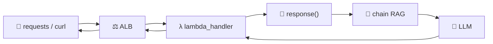

<h1 align="center">🏁 Deploy Rag - Chamada API e Response</h1>

<p align="center">
  
  
  
</p>

<h2 align="left">📡 curl</h2>

```bash
curl -X POST "http://<dns-do-alb>/" \
  -H "Content-Type: application/json" \
  -d '{"pergunta": "Qual é o tema principal do documento?"}'
```

```json
{
  "pergunta": "Qual é o tema principal do documento?",
  "resposta": "...",
  "paginas": [1, 2]
}
```

---

## 🐍 Python

```python
def perguntar(pergunta: str) -> dict:
    resposta = requests.post(API_URL, json={"pergunta": pergunta}, timeout=120)
    resposta.raise_for_status()
    return resposta.json()
```

`RAG_API_URL` no `.env` aponta para o DNS do ALB.

---

## 📌 Fluxo completo



| Aula | Etapa |
| :---: | :--- |
| 202–204 | `app.py`: load → `response` → `lambda_handler` |
| 205 | `requirements.txt` + `Dockerfile` |
| 206–207 | AWS CLI + push para o ECR |
| 208 | Lambda a partir da imagem |
| 209 | ALB expõe a Lambda |
| 210 | Chamada HTTP |

| Erro | Causa provável |
| :--- | :--- |
| `502` | Lambda quebrou ou retorno fora do formato do ALB |
| `504` / timeout | Cold start maior que o timeout da Lambda/ALB |
| `400` | Faltou `pergunta` no JSON |

---

## 🧹 Limpeza

ALB, target group, Lambda e repositório ECR → apagar para não gerar custo.

---

## ✅ Resumo

- O RAG local virou uma API: container no ECR, rodando na Lambda, exposto pelo ALB.
- Código: [210-...Chamada API e Response.py](210-Deploy%20Rag%20-%20Chamada%20API%20e%20Response.py)
