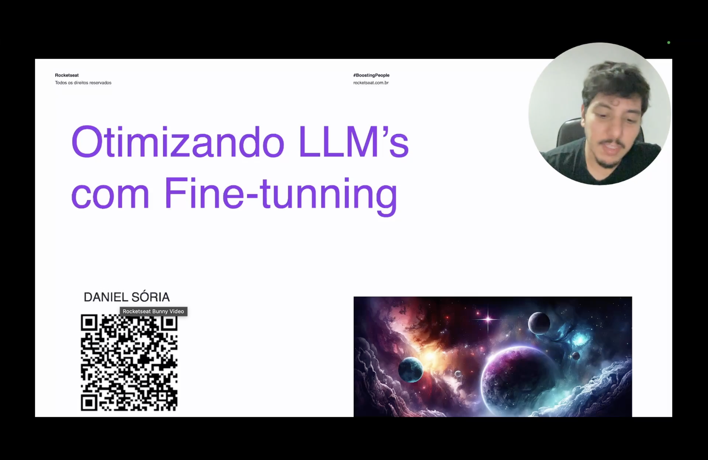
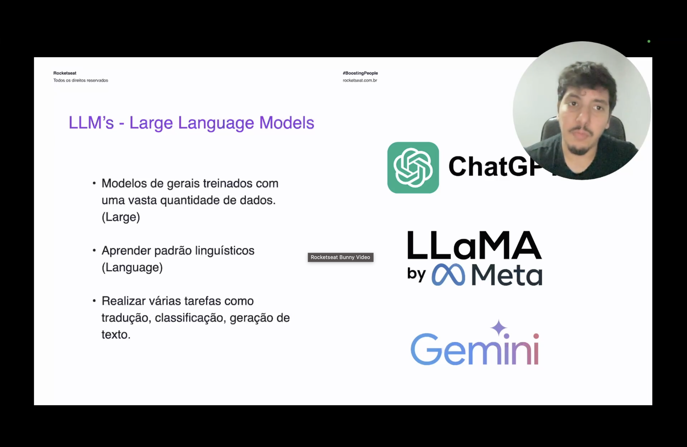
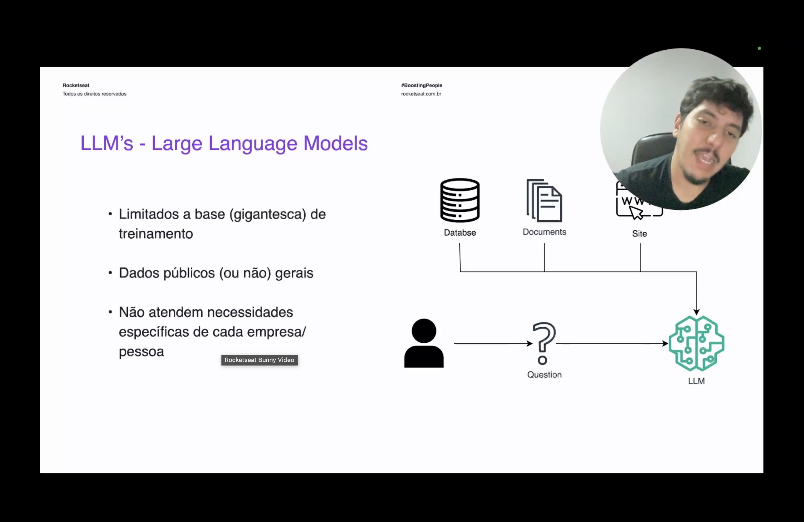
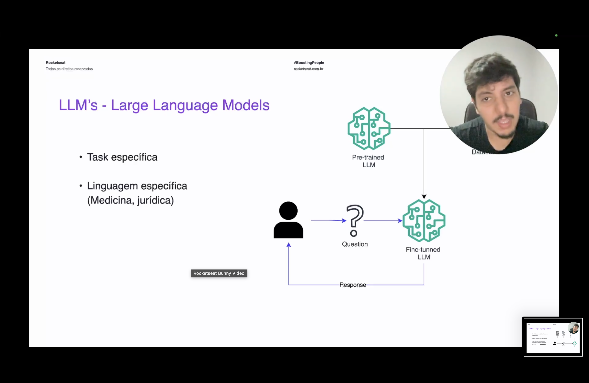
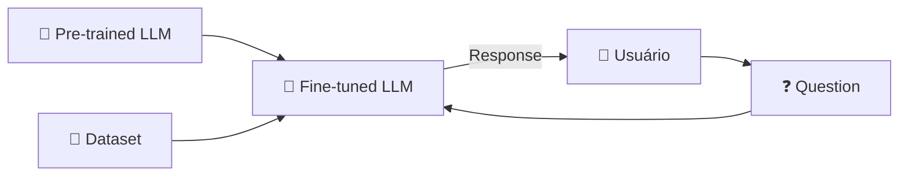
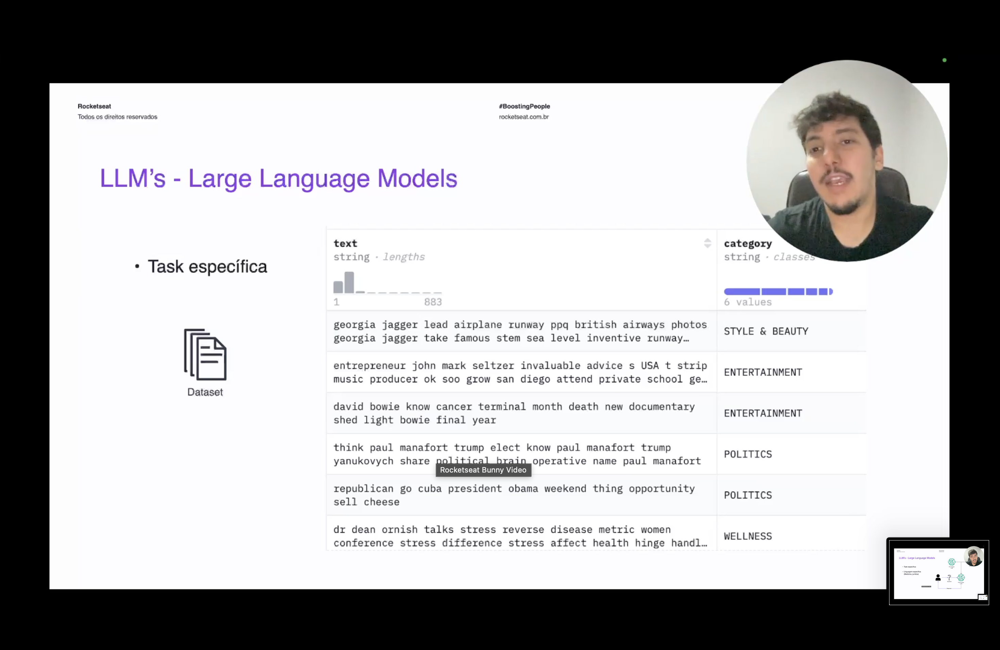
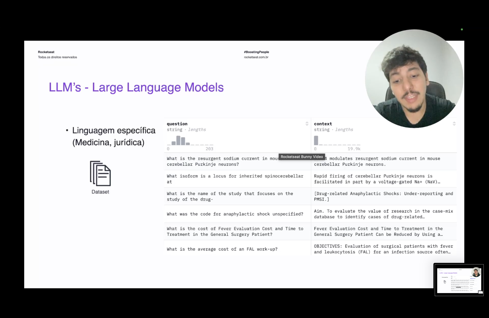

<h1 align="center">🎯 Otimizando LLMs com Fine Tuning - Introdução</h1>

  
  
  

<h2 align="left">🎯 Objetivo</h2>

Entender **por que** e **quando** fazer fine-tuning: pegar um LLM pré-treinado e especializá-lo com um dataset próprio.

---

## 🧠 O que é um LLM

| Letra | Significado |
| :---: | :--- |
| **Large** | Modelo geral treinado com uma vasta quantidade de dados |
| **Language** | Aprende padrões linguísticos |
| **Model** | Realiza várias tarefas: tradução, classificação, geração de texto |

Exemplos: **ChatGPT**, **LLaMA (Meta)**, **Gemini**.

---

## ⚠️ Limitações

- Limitado à base (gigantesca) de treinamento.
- Dados públicos (ou não) **gerais**.
- Não atende necessidades **específicas** de cada empresa/pessoa.

> No Nível 6 resolvemos isso com **RAG** (injetar contexto no prompt). Agora a abordagem é outra: **mudar o próprio modelo**.

---

## 🔧 Fine Tuning

Um LLM pré-treinado é treinado **mais um pouco** com um dataset específico, gerando um novo modelo especializado.

| Quando usar | Exemplo |
| :--- | :--- |
| **Task específica** | Classificar notícias por categoria |
| **Linguagem específica** | Medicina, jurídico |

---

## 📄 Exemplos de dataset

### Task específica — classificação

| text | category |
| :--- | :---: |
| georgia jagger lead airplane runway... | STYLE & BEAUTY |
| david bowie know cancer terminal... | ENTERTAINMENT |
| think paul manafort trump elect... | POLITICS |
| dr dean ornish talks stress... | WELLNESS |

### Linguagem específica — medicina

| question | context |
| :--- | :--- |
| What was the code for anaphylactic shock unspecified? | Aim. To evaluate the value of research in the case-mix database... |
| What is the average cost of an FAL work-up? | OBJECTIVES: Evaluation of surgical patients with fever and leukocytosis... |

---

## ⚖️ RAG x Fine Tuning

| | RAG | Fine Tuning |
| :--- | :--- | :--- |
| **O que muda** | O prompt (contexto) | Os pesos do modelo |
| **Dados novos** | Basta atualizar o Vector DB | Precisa re-treinar |
| **Ponto forte** | Conhecimento factual e atualizado | Estilo, formato, tarefa e vocabulário |

---

## ✅ Resumo

- LLMs são gerais; não conhecem o domínio de cada empresa/pessoa.
- Fine tuning = continuar o treino de um modelo pré-treinado com um **dataset específico**.
- Indicado para **tasks específicas** (ex.: classificação) e **linguagens específicas** (ex.: medicina, jurídico).
