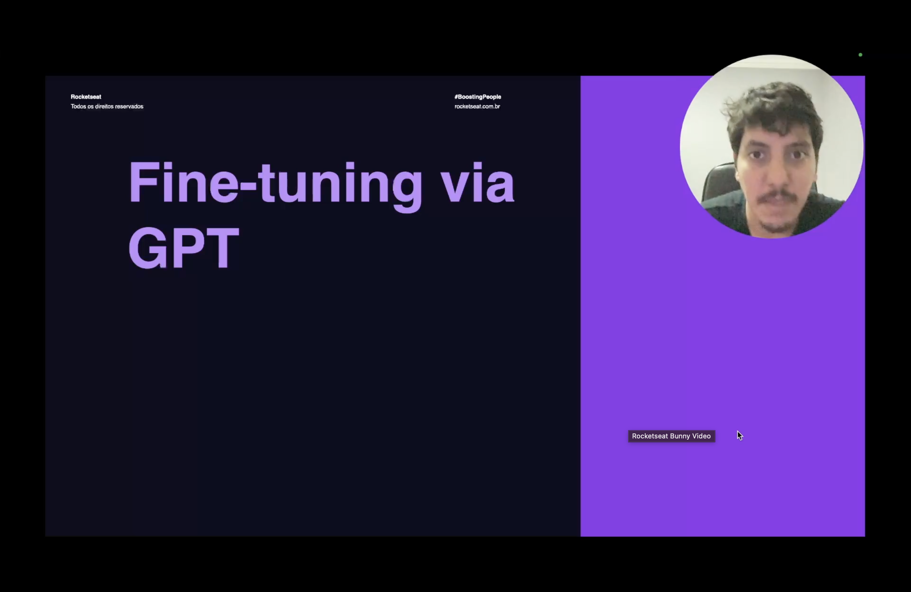
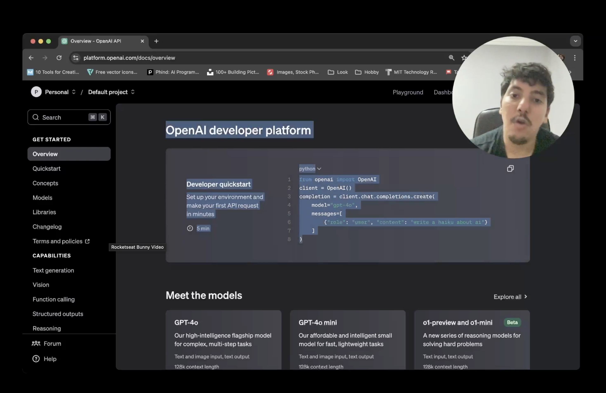
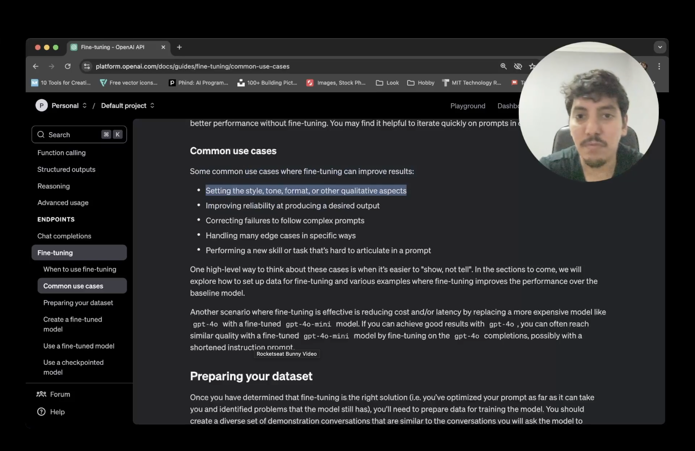
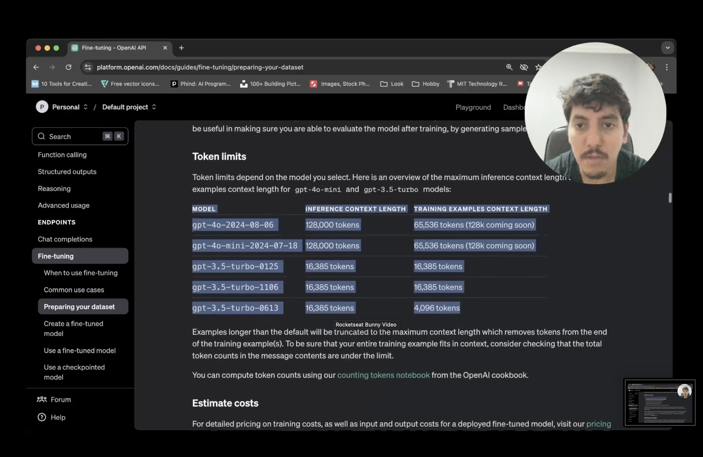
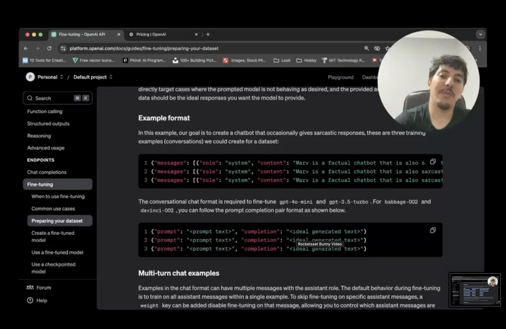
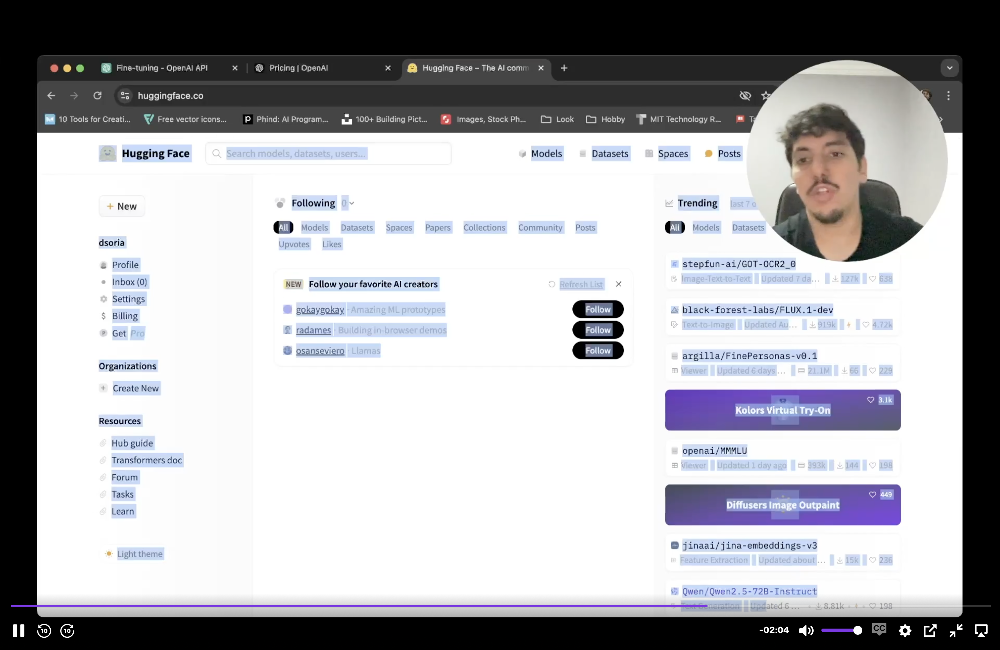
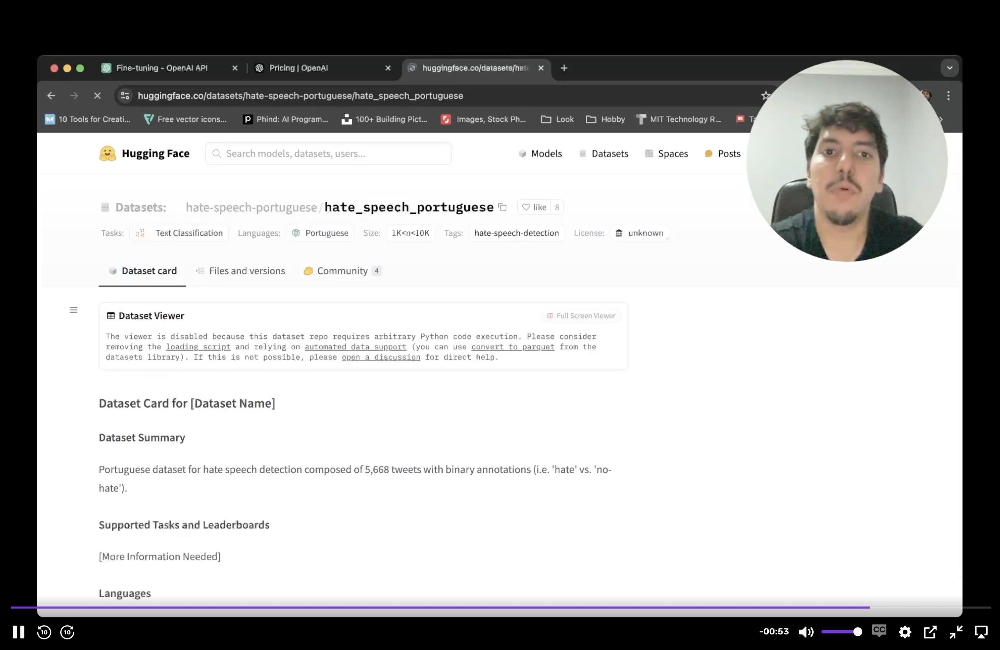

<h1 align="center">📄 Entendendo o Dataset - Fine-tuning</h1>

<p align="center">
  
  
  
</p>



<h2 align="left">🎯 Objetivo</h2>

Entender como a **OpenAI** espera o dataset de fine-tuning (formato, limites de tokens) e escolher um dataset real no **Hugging Face** para o projeto.

---

## 🌐 OpenAI Developer Platform



O fine-tuning será feito via API da OpenAI (`platform.openai.com/docs`). O uso base é o mesmo do chat completions:

```python
from openai import OpenAI

client = OpenAI()
completion = client.chat.completions.create(
    model="gpt-4o",
    messages=[{"role": "user", "content": "write a haiku about ai"}],
)
```

---

## 🧩 Quando o fine-tuning ajuda



Casos de uso comuns (docs → *Fine-tuning → Common use cases*):

- Definir **estilo, tom, formato** ou outros aspectos qualitativos.
- Aumentar a **confiabilidade** em produzir uma saída desejada.
- Corrigir falhas em seguir **prompts complexos**.
- Tratar muitos **edge cases** de forma específica.
- Ensinar uma **nova skill/task** difícil de explicar num prompt.

> Regra prática: quando é mais fácil **"mostrar do que explicar"**.

Outro ganho: **custo/latência** — fazer fine-tuning de um `gpt-4o-mini` com respostas do `gpt-4o` pode chegar a qualidade parecida, mais barato.

---

## 📏 Limites de tokens



| Modelo | Contexto de inferência | Contexto por exemplo de treino |
| :--- | :---: | :---: |
| `gpt-4o-2024-08-06` | 128.000 | 65.536 |
| `gpt-4o-mini-2024-07-18` | 128.000 | 65.536 |
| `gpt-3.5-turbo-0125` | 16.385 | 16.385 |
| `gpt-3.5-turbo-1106` | 16.385 | 16.385 |
| `gpt-3.5-turbo-0613` | 16.385 | 4.096 |

- Exemplos maiores que o limite são **truncados** (perdem tokens do final).
- Os custos de treino e uso do modelo fine-tunado estão na página de **Pricing** da OpenAI.

---

## 🗂️ Formato do dataset (JSONL)



Arquivo **`.jsonl`**: um exemplo (objeto JSON) por linha.

### Formato chat — `gpt-4o-mini`, `gpt-3.5-turbo`

```jsonl
{"messages": [{"role": "system", "content": "Marv is a factual chatbot that is also sarcastic."}, {"role": "user", "content": "What's the capital of France?"}, {"role": "assistant", "content": "Paris, as if everyone doesn't know that already."}]}
```

| role | Papel no exemplo |
| :--- | :--- |
| `system` | Instrução/persona do modelo |
| `user` | Entrada |
| `assistant` | **Resposta ideal** que o modelo deve aprender |

### Formato prompt/completion — `babbage-002`, `davinci-002`

```jsonl
{"prompt": "<prompt text>", "completion": "<ideal generated text>"}
```

---

## 🤗 Escolhendo o dataset no Hugging Face



O **Hugging Face** é o "GitHub da IA": hub de **Models**, **Datasets** e **Spaces**.



Dataset escolhido: **`hate-speech-portuguese/hate_speech_portuguese`**

| Campo | Valor |
| :--- | :--- |
| Task | Text Classification |
| Idioma | Português |
| Tamanho | 5.668 tweets |
| Rótulos | Binário: `hate` x `no-hate` |

> É um caso de **task específica** (classificação), como visto na aula 212. Na próxima etapa o dataset será convertido para o formato **chat JSONL** da OpenAI.

---

## ✅ Resumo

- Fine-tuning vale quando é mais fácil **mostrar exemplos** do que escrever o prompt.
- A OpenAI recebe o dataset em **JSONL**, no formato `messages` (system/user/assistant).
- Cada modelo tem um **limite de tokens** por exemplo de treino.
- Dataset do projeto: **detecção de discurso de ódio em português** (Hugging Face).
