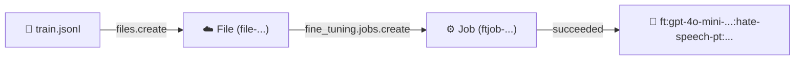

<h1 align="center">🚀 Fine-tuning GPT OpenAI</h1>

<p align="center">
  
  
  
</p>

<h2 align="left">🎯 Objetivo</h2>

Enviar o `train.jsonl` para a OpenAI, criar o **job de fine-tuning** sobre o `gpt-4o-mini` e acompanhar até o modelo ficar pronto.

---

## 📦 Setup

```bash
pip install openai python-dotenv
```

`.env` com a chave:

```env
OPENAI_API_KEY=sk-...
```



---

## 🔗 Reaproveitando a aula 217

```python
if not TRAIN_FILE.exists():
    runpy.run_path(str(BASE_DIR / "217-Finalizando Dataset.py"))
```

Como o nome do arquivo tem espaços e hífen, não dá para fazer `import`. O `runpy.run_path` executa o script da 217 e gera o `data/train.jsonl` se ele ainda não existir.

---

## 1️⃣ Upload do dataset

```python
with open(TRAIN_FILE, "rb") as f:
    train_file = client.files.create(file=f, purpose="fine-tune")
```

| Parâmetro | Função |
| :--- | :--- |
| `"rb"` | O arquivo é enviado em binário |
| `purpose="fine-tune"` | A OpenAI valida o formato JSONL `messages` no upload |

---

## 2️⃣ Criando o job

```python
job = client.fine_tuning.jobs.create(
    model="gpt-4o-mini-2024-07-18",
    training_file=train_file.id,
    suffix="hate-speech-pt",
)
```

| Parâmetro | Função |
| :--- | :--- |
| `model` | Modelo base; precisa ser o **snapshot com data** |
| `training_file` | ID do arquivo enviado (`file-...`) |
| `suffix` | Aparece no nome do modelo final, para identificá-lo |

> Opcionais: `validation_file` (mede a loss em dados fora do treino) e `hyperparameters={"n_epochs": ...}`. Sem eles, a OpenAI escolhe as épocas automaticamente.

---

## 3️⃣ Acompanhando o job

```python
while job.status not in ("succeeded", "failed", "cancelled"):
    time.sleep(30)
    job = client.fine_tuning.jobs.retrieve(job.id)
    events = client.fine_tuning.jobs.list_events(job.id, limit=1)
    print(f"[{job.status}] {events.data[0].message}")
```

| Status | Significado |
| :--- | :--- |
| `validating_files` | Conferindo o JSONL |
| `queued` | Na fila |
| `running` | Treinando (eventos mostram `Step x/y: training loss=...`) |
| `succeeded` | Modelo pronto em `job.fine_tuned_model` |
| `failed` / `cancelled` | Detalhes em `job.error` |

> O job roda na OpenAI: dá para fechar o script e acompanhar em **platform.openai.com → Fine-tuning**. O treino pode levar de minutos a algumas horas, dependendo da fila.

---

## 4️⃣ Guardando o modelo

```python
MODEL_FILE.write_text(job.fine_tuned_model)
```

O nome (`ft:gpt-4o-mini-2024-07-18:<org>:hate-speech-pt:<id>`) fica em `data/fine_tuned_model.txt` para a aula 219.

---

## 💰 Custo

O dataset de treino tem **~350 mil tokens**. O custo é cobrado por token treinado, ou seja, `tokens × épocas`. O valor por token está na página de **Pricing** da OpenAI. `job.trained_tokens` mostra o total real no final.

---

## ✅ Resumo

- `files.create(purpose="fine-tune")` envia o JSONL.
- `fine_tuning.jobs.create` inicia o treino sobre um snapshot do `gpt-4o-mini`.
- O job passa por `validating_files → queued → running → succeeded`.
- O resultado é um **novo modelo** (`ft:...`), usado como qualquer outro no `chat.completions`.
