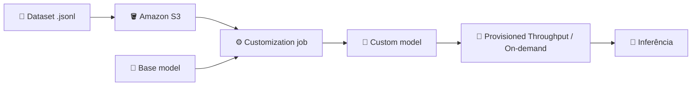

<h1 align="center">☁️ AWS Bedrock - Introdução</h1>

  
  
  

<h2 align="left">🎯 Objetivo</h2>

Conhecer o **Amazon Bedrock**, o serviço da AWS para usar e **customizar** LLMs de vários fornecedores, como alternativa ao fine-tuning da OpenAI (aulas 218 e 219).

---

## 🧠 O que é o Bedrock

Serviço **gerenciado e serverless** que dá acesso, por **uma única API**, a *foundation models* (FMs) de vários fornecedores.

| Fornecedor | Modelos |
| :--- | :--- |
| **Amazon** | Nova, Titan |
| **Anthropic** | Claude |
| **Meta** | Llama |
| **Mistral AI** | Mistral, Mixtral |
| **Cohere** | Command, Embed |

> Não há servidor nem GPU para gerenciar. Você escolhe o modelo, chama a API e paga pelo uso.

---

## 🧩 Principais recursos

| Recurso | Para que serve |
| :--- | :--- |
| **Playgrounds** | Testar modelos pelo console (chat, texto, imagem) |
| **Knowledge Bases** | RAG gerenciado (o mesmo conceito do Nível 6) |
| **Agents** | Agentes que chamam APIs e ferramentas |
| **Guardrails** | Filtros de conteúdo e de dados sensíveis |
| **Custom models** | **Fine-tuning** e *continued pre-training* |

---

## 🔧 Fine-tuning no Bedrock

1. Sobe o dataset (`train.jsonl` e, opcionalmente, validação) para um bucket **S3**.
2. Cria um **customization job** escolhendo o modelo base e os hiperparâmetros (epochs, batch size, learning rate).
3. O resultado é um **custom model** salvo na sua conta.
4. Para usar, é preciso disponibilizá-lo para inferência (em geral via **Provisioned Throughput**).

| Tipo | O que faz |
| :--- | :--- |
| **Fine-tuning** | Dados **rotulados** (prompt → resposta) para ensinar uma task |
| **Continued pre-training** | Dados **não rotulados** para ensinar o vocabulário de um domínio |

> O formato do `.jsonl` varia conforme o modelo base. Confira na documentação qual esquema o modelo escolhido espera.

---

## ⚖️ OpenAI x Bedrock

| | OpenAI | AWS Bedrock |
| :--- | :--- | :--- |
| **Modelos** | Só GPT | Vários fornecedores |
| **Dataset** | Upload pela API | Bucket S3 |
| **Inferência** | Mesmo endpoint, nome `ft:...` | Provisioned Throughput / on-demand |
| **Ponto forte** | Simplicidade | Integração com o ecossistema AWS (IAM, S3, VPC) |

---

## 🔐 Pré-requisitos

- Conta AWS com permissões no **IAM** para Bedrock e S3.
- **Acesso aos modelos** liberado no console (*Model access*), por região.
- Escolher uma **região** que suporte customização do modelo desejado.
- SDK Python: `pip install boto3`.

> ⚠️ Custom models e Provisioned Throughput **são cobrados por hora**. Apague o que não estiver usando.

---

## ✅ Resumo

- Bedrock = acesso serverless a LLMs de vários fornecedores por uma única API.
- Além de inferência, oferece RAG (Knowledge Bases), Agents, Guardrails e **customização de modelos**.
- O fine-tuning usa dataset no **S3** + **customization job**, e gera um **custom model**.
- Comparado à OpenAI, troca simplicidade por **variedade de modelos** e **integração com a AWS**.
