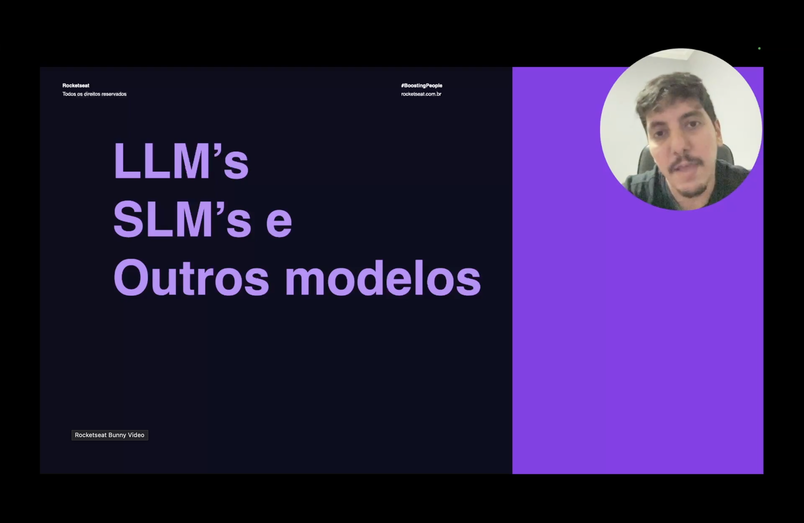
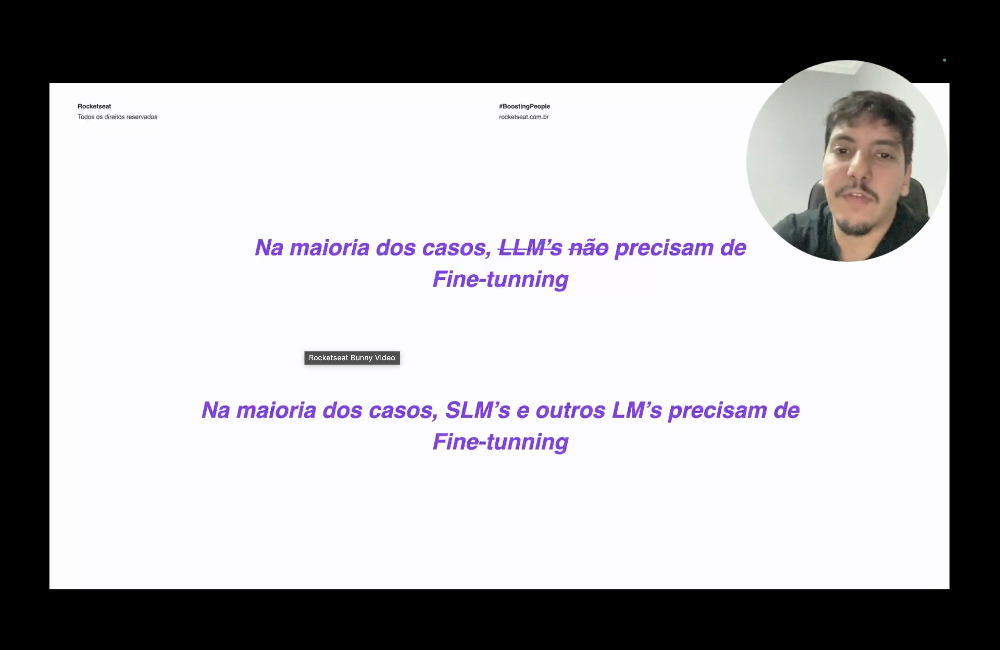
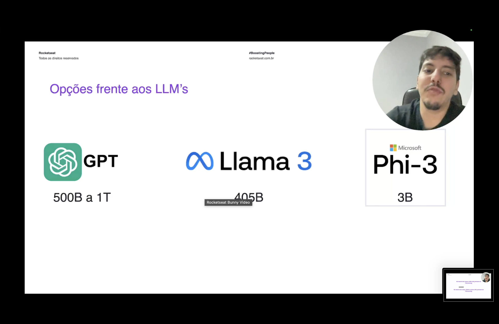
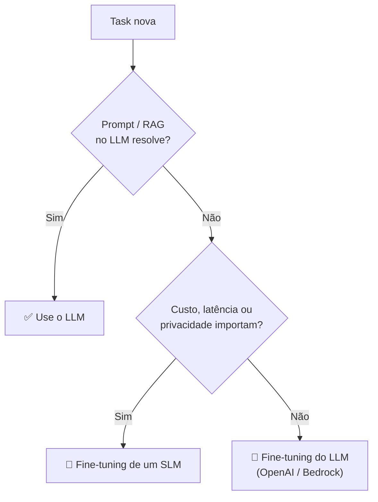

<h1 align="center">🧭 Opções para os LLMs</h1>

  
  
  

<h2 align="left">🎯 Objetivo</h2>

Entender a diferença entre **LLMs**, **SLMs** e outros modelos, e **quando o fine-tuning realmente vale a pena**.

---

## 🤔 Quem precisa de fine-tuning?

> ~~Na maioria dos casos, LLMs não precisam de fine-tuning.~~
> **Na maioria dos casos, SLMs e outros LMs precisam de fine-tuning.**

- **LLMs** (GPT, Claude, Llama 405B) já são muito bons em quase tudo. Na maioria dos casos, **prompt engineering** e **RAG** (Nível 6) resolvem.
- **SLMs** (*Small Language Models*) são genéricos e mais fracos. Com fine-tuning, ficam **bons em uma task específica**, muitas vezes no nível de um LLM.

---

## 📏 Opções frente aos LLMs

| Modelo | Fornecedor | Parâmetros | Tipo |
| :--- | :--- | :--- | :--- |
| **GPT** | OpenAI | ~500B a 1T *(estimativa, não oficial)* | LLM fechado |
| **Llama 3** | Meta | 405B (maior versão) | LLM open weights |
| **Phi-3** | Microsoft | ~3B (mini) | SLM open weights |

> O número de **parâmetros** é o tamanho do modelo. Mais parâmetros = mais conhecimento geral, mas também mais custo e latência.

---

## ⚖️ LLM x SLM

| | LLM | SLM |
| :--- | :--- | :--- |
| **Qualidade geral** | Alta | Menor |
| **Custo de inferência** | Alto | Baixo |
| **Latência** | Maior | Menor |
| **Onde roda** | API / cluster de GPUs | GPU simples, notebook, celular |
| **Fine-tuning** | Caro, raramente necessário | Barato e **geralmente necessário** |
| **Privacidade** | Dados vão para o fornecedor | Pode rodar **local** |

---

## 🧩 Quando escolher cada um

---

## ✅ Resumo

- LLMs (GPT, Llama 405B) raramente precisam de fine-tuning: prompt e RAG costumam bastar.
- SLMs (Phi-3, ~3B) são leves e baratos, e é neles que o fine-tuning faz mais diferença.
- Um SLM fine-tunado pode igualar um LLM em uma task específica, com menos custo e latência.
- A escolha depende de **qualidade x custo x latência x privacidade**.
