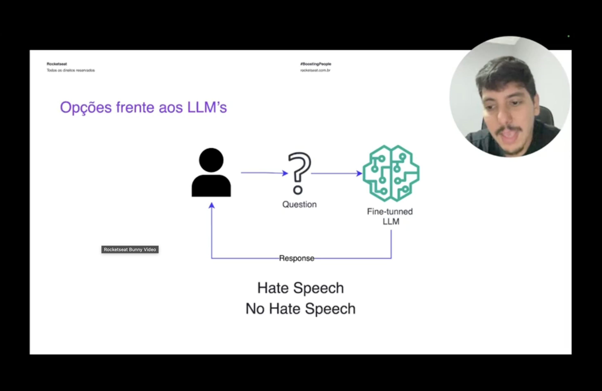
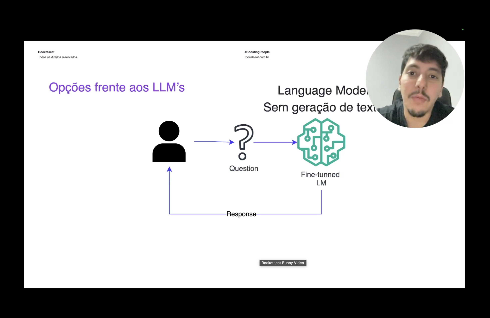
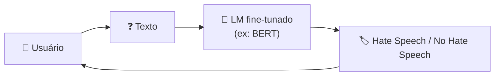
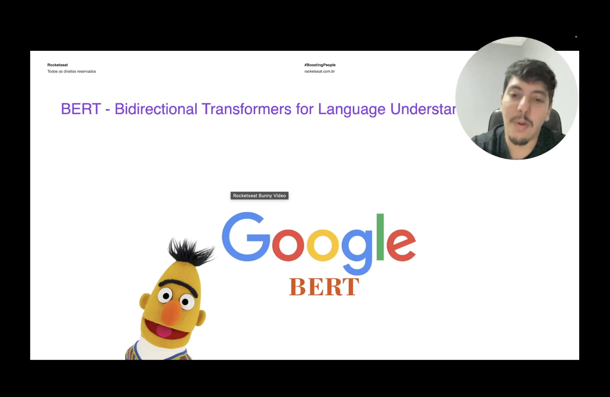

<h1 align="center">🐤 Opções de LMs - BERT</h1>

<p align="center">
  
  
  
</p>

<h2 align="left">🎯 Objetivo</h2>

Entender que nem toda task precisa de um modelo que **gera texto**. Para **classificação**, um **LM sem geração de texto**, como o **BERT**, com fine-tuning resolve o problema com muito menos custo.

---

## 🛑 Exemplo: detecção de discurso de ódio



O usuário manda um texto e o modelo responde só uma de duas classes:

| Entrada | Saída |
| :--- | :--- |
| Texto do usuário | `Hate Speech` ou `No Hate Speech` |

> Usar um **LLM fine-tunado** aqui funciona, mas é **exagero**: um modelo de centenas de bilhões de parâmetros gerando texto só para escolher entre 2 rótulos.

---

## 🧠 LM sem geração de texto



Em vez de um LLM, dá para usar um **Language Model** que **entende** o texto mas **não gera** texto. Ele recebe a entrada e devolve uma **classe** (ou um vetor/embedding).



| | LLM generativo | LM sem geração (BERT) |
| :--- | :--- | :--- |
| **Saída** | Texto livre | Classe, score ou embedding |
| **Tamanho** | Bilhões de parâmetros | ~110M (base) / ~340M (large) |
| **Custo / latência** | Alto | Muito baixo |
| **Onde roda** | API / GPUs | CPU, GPU simples |
| **Bom para** | Conversa, resumo, geração | Classificação, NER, similaridade |

---

## 🐤 BERT



**BERT** = *Bidirectional Encoder Representations from Transformers*, criado pelo **Google** em 2018.

- Usa só o **encoder** do Transformer (o GPT usa só o **decoder**).
- É **bidirecional**: lê o contexto à esquerda **e** à direita de cada palavra ao mesmo tempo, por isso entende bem o sentido da frase.
- Pré-treinado com **Masked Language Modeling**: esconde palavras aleatórias e o modelo aprende a adivinhá-las.

```text
"O gato [MASK] no telhado"  →  BERT  →  "subiu"
```

### Fine-tuning para classificação

Coloca-se uma **camada de classificação** em cima do BERT e treina com exemplos rotulados (`texto → label`). O modelo pré-treinado já entende a língua, o fine-tuning só ensina a **task**.

| Variante | Observação |
| :--- | :--- |
| **BERT base / large** | Originais do Google (inglês) |
| **BERTimbau** | BERT treinado em **português** |
| **DistilBERT** | Versão menor e mais rápida (~40% menor) |
| **RoBERTa** | Versão da Meta com treino melhorado |

> Todos estão disponíveis no **Hugging Face** e são usados com a biblioteca `transformers`.

---

## ✅ Resumo

- Nem toda task precisa gerar texto: **classificação** (ex: discurso de ódio) só precisa escolher um rótulo.
- Para isso, um **LM sem geração** fine-tunado é mais barato e rápido que um LLM.
- **BERT** (Google) é um Transformer **encoder**, **bidirecional**, pré-treinado com palavras mascaradas.
- Com uma camada de classificação + fine-tuning, vira um classificador forte e leve.
