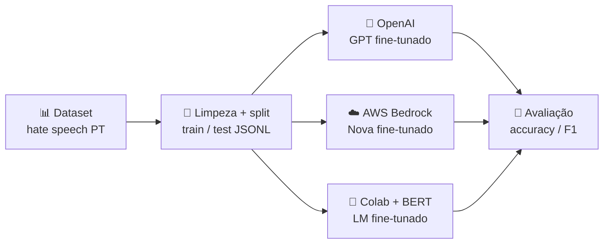

<h1 align="center">🏁 Encerramento</h1>

  
  
  

<h2 align="left">🎯 Objetivo</h2>

Revisar o que foi feito no Nível 7 e quando usar cada abordagem de fine-tuning.

---

## 🗺️ O caminho do módulo

| Etapa | Aulas | O que ficou |
| :--- | :---: | :--- |
| **Introdução** | 212 | LLMs são gerais; fine-tuning especializa o modelo com dados próprios |
| **Dataset** | 213–217 | Carregar, limpar, `train_test_split` estratificado, formato `messages`, JSONL |
| **OpenAI** | 218–219 | Upload, job de fine-tuning e comparação base x fine-tunado |
| **AWS Bedrock** | 220–223 | Customização de modelo, S3, deploy on-demand e limpeza de recursos |
| **Alternativas** | 224–225 | Nem toda task precisa de LLM; **BERT** para classificação |
| **Colab + BERT** | 226–230 | `Trainer`, métricas, `push_to_hub` e `pipeline` |

---

## ⚖️ Quando usar o quê

| Situação | Abordagem |
| :--- | :--- |
| Precisa de conhecimento **atualizado / específico** em documentos | **RAG** (Nível 6) |
| Precisa mudar **estilo, formato ou comportamento** do modelo generativo | **Fine-tuning de LLM** (OpenAI, Bedrock) |
| Task de **classificação** / extração com rótulos fixos | **Fine-tuning de LM** (BERT) — mais barato e rápido |
| Poucos exemplos e task simples | **Prompt engineering** primeiro |

> RAG e fine-tuning **não competem**: dá para usar os dois juntos.

---

## ✅ Resumo

- Fine-tuning = pegar um modelo pré-treinado e especializá-lo com um dataset rotulado.
- A qualidade do **dataset** (limpeza, balanceamento, split) decide boa parte do resultado.
- Avaliar sempre contra o **modelo base** e com métricas além da acurácia (**F1**).
- Escolher o **menor modelo que resolve a task**: muitas vezes um BERT basta.
