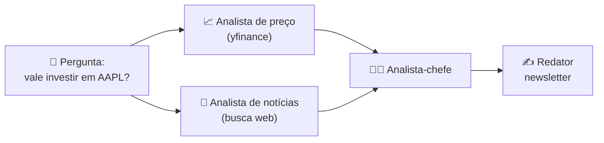

<h1 align="center">🤖 Introdução</h1>

  
  
  

<h2 align="left">🎯 Objetivo</h2>

Entender por que um **chat com LLM** não basta para tarefas reais e o que muda quando passamos a usar **agentes**.

---

## 💬 O problema do chat "puro"

No vídeo, a pergunta ao ChatGPT foi:

> *"O que você acha sobre as ações da Apple? Faça uma análise baseada nos..."*

A resposta é **genérica**: ecossistema, dividendos, riscos, volatilidade... Tudo verdade, mas:

| Limitação | Por quê |
| :--- | :--- |
| **Sem dados atuais** | O modelo só sabe o que viu no treino (sem preço de hoje, sem notícia da semana) |
| **Sem ação** | Ele não consulta uma API, não busca na web, não salva um arquivo |
| **Uma "cabeça" só** | O mesmo prompt faz o papel de analista de preço, de notícias e de redator |
| **Sem processo** | Não existe um passo a passo verificável: é uma resposta única |

---

## 🧠 A ideia do módulo

Em vez de um prompt gigante, dividir o problema entre **agentes especializados**, cada um com:

- um **papel** (ex.: analista de preço);
- um **objetivo** claro;
- **ferramentas** (ex.: API de cotações, busca de notícias);
- e uma **tarefa** que gera uma saída usada pelo próximo agente.

---

## 🗺️ O que vem no módulo

| Seção | Aulas | Conteúdo |
| :--- | :---: | :--- |
| **Introdução** | 233–236 | Agentes, multi-agentes e frameworks |
| **CrewAI** | 237–249 | Agents, Tasks, Crew, Tools e um projeto de **newsletter de ações** |
| **AutoGen Studio** | 250–256 | Interface visual, Group Chat e agentes que **geram imagens** |

---

## ✅ Resumo

- LLM sozinho responde com o que já sabe: sem dados atuais e sem executar ações.
- Agentes = LLM + papel + objetivo + ferramentas + tarefas.
- Vários agentes especializados colaborando resolvem melhor problemas com várias etapas.
