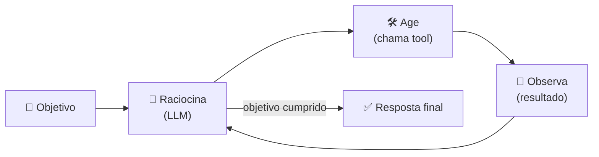

<h1 align="center">🧩 O que são Agentes de IA</h1>

  
  
  

<h2 align="left">🎯 Objetivo</h2>

Definir o que é um **agente de IA** e quais são as peças que o compõem.

---

## 📖 Definição

Um **agente** é um sistema que usa um LLM para **decidir quais ações tomar** para alcançar um objetivo, observando o resultado de cada ação antes de decidir a próxima.

> LLM = cérebro que **responde**. Agente = cérebro + mãos que **agem**.

---

## 🔁 O loop do agente

Esse padrão é conhecido como **ReAct** (*Reasoning + Acting*): pensar → agir → observar → repetir.

---

## 🧱 Componentes de um agente

| Componente | O que é | Exemplo |
| :--- | :--- | :--- |
| **LLM** | O "cérebro" que decide | `gpt-4o-mini` |
| **Papel / persona** | Quem o agente é | "Analista financeiro sênior" |
| **Objetivo** | O que ele precisa entregar | "Avaliar a tendência de preço de AAPL" |
| **Tools** | Funções que ele pode chamar | API de cotações, busca web, executar código |
| **Memória** | O que ele lembra entre passos | Histórico da conversa, resultados anteriores |
| **Planejamento** | Como quebra o objetivo em passos | Primeiro buscar preço, depois notícias... |

---

## ⚖️ Chat x Agente

| | Chat com LLM | Agente |
| :--- | :--- | :--- |
| **Fluxo** | Pergunta → resposta | Loop até cumprir o objetivo |
| **Dados externos** | Não (ou só via RAG) | Sim, via tools |
| **Ações** | Não | Chama APIs, escreve arquivos, executa código |
| **Autonomia** | Nenhuma | Decide o próximo passo |

---

## ✅ Resumo

- Agente = LLM que **raciocina, age com tools e observa** em loop.
- Peças: LLM, papel, objetivo, tools, memória e planejamento.
- A diferença para o chat é a **autonomia** e a capacidade de **agir no mundo**.
