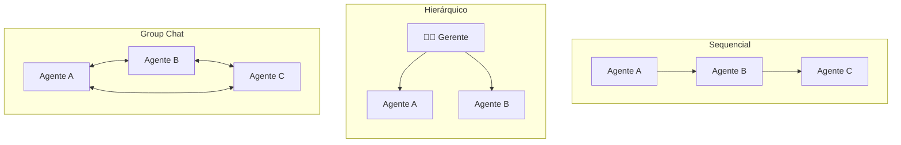

<h1 align="center">👥 Multi-agentes de IA</h1>

  
  
  

<h2 align="left">🎯 Objetivo</h2>

Entender por que dividir um problema entre **vários agentes especializados** funciona melhor que um único agente "faz-tudo".

---

## 🏢 A analogia da empresa

Uma empresa não tem um funcionário que faz tudo: tem gerente, analistas, redator... Cada um é bom em uma coisa e entrega para o próximo.

**Sistemas multi-agentes** seguem a mesma lógica:

| Agente único | Multi-agentes |
| :--- | :--- |
| Prompt enorme, com muitas instruções | Prompts curtos e focados por agente |
| Muitas tools → o LLM se confunde na escolha | Cada agente só vê as tools dele |
| Difícil saber onde errou | Cada etapa tem uma saída que dá para inspecionar |
| Difícil de reaproveitar | Agentes reutilizáveis em outros fluxos |

---

## 🔀 Formas de colaboração

| Padrão | Como funciona | Onde aparece no curso |
| :--- | :--- | :--- |
| **Sequencial** | A saída de um vira entrada do próximo | Crew de análise de ações (CrewAI) |
| **Hierárquico** | Um gerente delega e revisa | `Process.hierarchical` do CrewAI |
| **Group Chat** | Agentes conversam e um seletor decide quem fala | Workflow do AutoGen Studio |

---

## ⚠️ Cuidados

- Mais agentes = **mais chamadas ao LLM** = mais custo e latência.
- Agentes podem entrar em **loop** conversando entre si: sempre ter um limite de iterações/mensagens.
- Só dividir quando as etapas forem **realmente diferentes**.

---

## ✅ Resumo

- Multi-agentes = vários agentes especializados colaborando, como uma equipe.
- Prompts e tools focados deixam cada agente mais preciso e o fluxo mais fácil de depurar.
- Padrões principais: **sequencial**, **hierárquico** e **group chat**.
