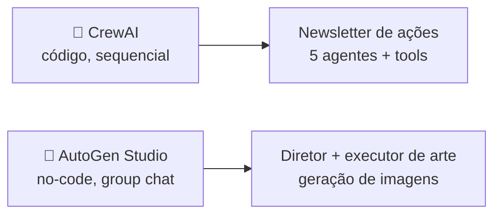

<h1 align="center">🧰 Frameworks para Agentes de IA</h1>

  
  
  

<h2 align="left">🎯 Objetivo</h2>

Conhecer os principais frameworks para construir agentes e entender por que o curso usa **CrewAI** e **AutoGen Studio**.

---

## 🤔 Por que um framework?

Dá para fazer o loop do agente "na mão" com a API da OpenAI (tool calling + `while`). O framework resolve o que se repete:

- loop **raciocinar → agir → observar**;
- definição e validação de **tools**;
- passagem de contexto entre agentes;
- memória, logs, limites de iteração e retries.

---

## 📦 Principais opções

| Framework | Criador | Estilo | Destaque |
| :--- | :--- | :--- | :--- |
| **CrewAI** | CrewAI Inc. | Código (Python) | Agents com papel/objetivo/backstory organizados em uma **Crew** |
| **AutoGen / AutoGen Studio** | Microsoft | Código + **interface visual** | Agentes que **conversam** (group chat), execução de código |
| **LangGraph** | LangChain | Código (grafo de estados) | Controle fino do fluxo, ciclos e checkpoints |
| **OpenAI Agents SDK** | OpenAI | Código | Agents, handoffs e guardrails integrados à API da OpenAI |
| **Claude Agent SDK** | Anthropic | Código | Loop de agente do Claude Code com tools de arquivos/terminal |
| **LlamaIndex Agents** | LlamaIndex | Código | Agentes focados em dados/RAG |

---

## 🎓 O que usamos no curso

- **CrewAI**: abstrações simples (`Agent`, `Task`, `Crew`), ótimo para fluxos de "equipe" bem definidos.
- **AutoGen Studio**: monta agentes e workflows pela interface, bom para prototipar sem código.

---

## ✅ Resumo

- Frameworks cuidam do loop, das tools e da comunicação entre agentes.
- CrewAI = equipe com papéis e tarefas; AutoGen = agentes conversando.
- LangGraph, OpenAI Agents SDK e Claude Agent SDK são alternativas populares.
