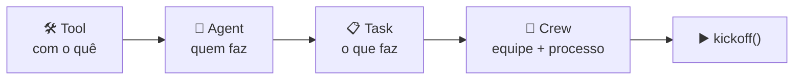

<h1 align="center">🚢 Introdução ao CrewAI</h1>

<p align="center">
  
  
  
</p>

<h2 align="left">🎯 Objetivo</h2>

Conhecer os 4 conceitos centrais do **CrewAI** e preparar o ambiente.

---

## 🧱 Conceitos



| Conceito | Papel | Analogia |
| :--- | :--- | :--- |
| **Agent** | Membro da equipe com `role`, `goal` e `backstory` | Funcionário |
| **Task** | Trabalho com `description` e `expected_output`, atribuído a um agente | Demanda / ticket |
| **Tool** | Função que o agente pode chamar | Ferramenta de trabalho |
| **Crew** | Junta agentes + tasks e define o **processo** | Equipe / projeto |

---

## ⚙️ Setup

```bash
python -m venv .venv && source .venv/bin/activate
pip install crewai crewai-tools python-dotenv
```

`.env` (já está no `.gitignore` da raiz):

```env
OPENAI_API_KEY=sk-...
```

> O CrewAI usa a OpenAI por padrão, mas aceita outros provedores (Anthropic, Gemini, Ollama...) via `LLM(model="provedor/modelo")`.

---

## 🔄 Processos

| Processo | Como executa |
| :--- | :--- |
| `Process.sequential` | Tasks na ordem da lista; a saída de uma vira contexto da próxima |
| `Process.hierarchical` | Um **manager** (LLM) delega as tasks aos agentes e valida o resultado |

---

## ✅ Resumo

- CrewAI organiza agentes como uma **equipe**: Agent, Task, Tool e Crew.
- Instalação: `pip install crewai crewai-tools`, chave da OpenAI no `.env`.
- Processo **sequencial** (padrão) ou **hierárquico** (com gerente).
