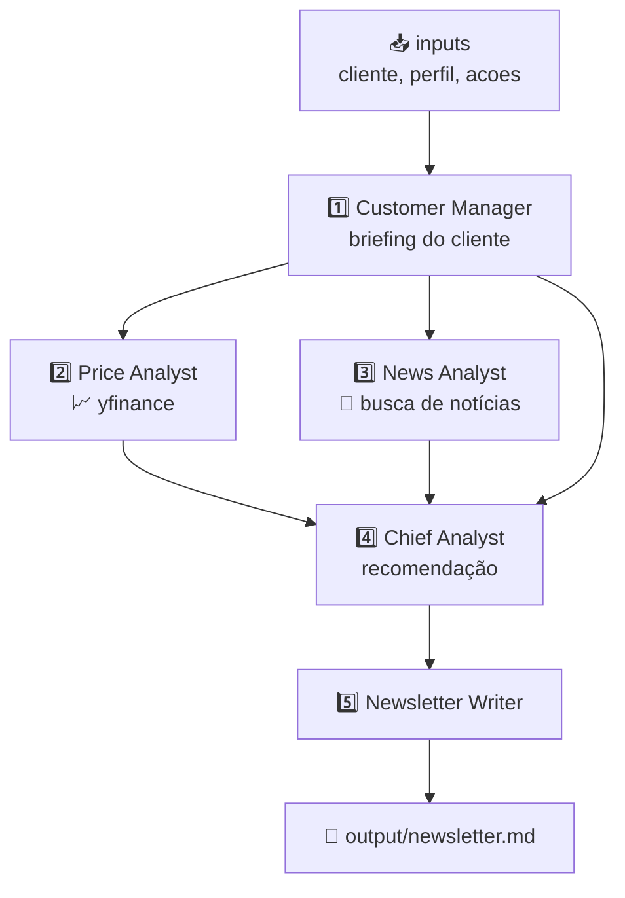

<h1 align="center">✏️ Desenhando a solução</h1>

  
  
  

<h2 align="left">🎯 Objetivo</h2>

Desenhar a Crew que resolve o problema da aula 233: em vez da análise genérica do ChatGPT, gerar uma **newsletter de ações** com **preço real** e **notícias recentes**, adaptada ao perfil do cliente.

---

## 🧑‍🤝‍🧑 A equipe

| # | Agente | Responsabilidade | Tool |
| :---: | :--- | :--- | :--- |
| 1 | **Customer Manager** | Entende o cliente: perfil, objetivo e ações de interesse | — |
| 2 | **Price Analyst** | Analisa histórico de preço e tendência | `yfinance` |
| 3 | **News Analyst** | Busca e resume notícias recentes, com sentimento | Busca de notícias (`ddgs`) |
| 4 | **Chief Analyst** | Cruza preço + notícias + perfil e dá a recomendação | — |
| 5 | **Newsletter Writer** | Escreve a newsletter final em markdown | — |

---

## 🔀 Fluxo (Process.sequential)

O `context` de cada task deixa explícito **quem lê a saída de quem**.

---

## 🗂️ Arquivos

| Aula | Arquivo | Conteúdo |
| :---: | :--- | :--- |
| 244 | `244-Agente Customer Manager.py` | Agente + task do briefing |
| 245 | `245-Agente Price Analyst.py` | Tool de preço + agente + task |
| 246 | `246-Agente News Analyst.py` | Tool de notícias + agente + task |
| 247 | `247-Agente Chief Analyst.py` | Agente + task de recomendação |
| 248 | `248-Agente Newsletter Writer.py` | Agente + task da newsletter |
| 249 | `249-Executando a Crew.py` | Liga os contexts, monta a Crew e executa |

---

## ✅ Resumo

- 5 agentes, cada um com uma responsabilidade única.
- Só os analistas de **preço** e **notícias** precisam de tools (dados externos).
- O analista-chefe e o redator trabalham só com o **contexto** das tasks anteriores.
