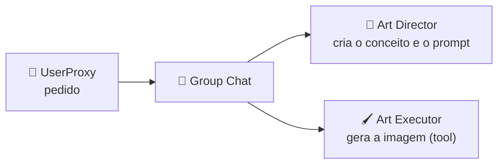

<h1 align="center">🧪 Introdução ao AutoGen Studio</h1>

<p align="center">
  
  
  
</p>

<h2 align="left">🎯 Objetivo</h2>

Conhecer o **AutoGen** (Microsoft) e sua interface visual, o **AutoGen Studio**, e subir o ambiente local.

---

## 🧠 AutoGen x AutoGen Studio

| | AutoGen | AutoGen Studio |
| :--- | :--- | :--- |
| **O que é** | Framework Python de multi-agentes | Interface web (low-code) em cima do AutoGen |
| **Como cria agentes** | Código | Formulários e drag-and-drop |
| **Ideia central** | Agentes que **conversam** entre si | Prototipar e testar workflows rápido |
| **Exporta** | — | Config em **JSON**, reutilizável no código |

---

## ⚙️ Instalação

```bash
python -m venv .venv && source .venv/bin/activate
pip install autogenstudio
export OPENAI_API_KEY=sk-...
autogenstudio ui --port 8081 --appdir ./studio
```

Abrir `http://localhost:8081`.

---

## 🧱 Blocos da interface

| Bloco | O que é |
| :--- | :--- |
| **Models** | Configuração do LLM (provedor, modelo, API key) |
| **Skills / Tools** | Funções Python que os agentes podem chamar (ex.: `generate_images`) |
| **Agents** | `AssistantAgent` (LLM) e `UserProxyAgent` (representa o usuário / executa código) |
| **Workflows / Teams** | Como os agentes conversam: dupla ou **Group Chat** |
| **Playground** | Onde se roda o workflow e vê a conversa entre agentes |

> Nas versões 0.4+ o Studio renomeou *Skills* → **Tools** e *Workflows* → **Teams**, mas a lógica é a mesma.

---

## 🎨 Projeto desta seção

Um workflow com dois agentes de arte:



---

## ✅ Resumo

- AutoGen = multi-agentes por **conversa**; Studio = interface visual para ele.
- `pip install autogenstudio` + `autogenstudio ui`.
- Blocos: Models, Skills/Tools, Agents, Workflows/Teams e Playground.
