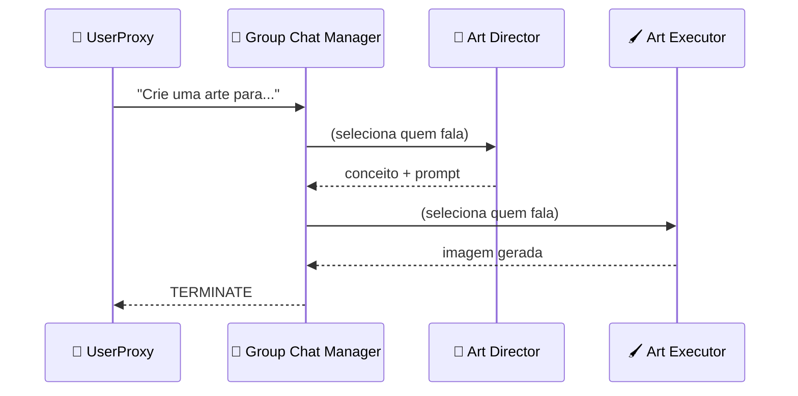

<h1 align="center">💬 UserProxy e Group Chat</h1>

  
  
  

<h2 align="left">🎯 Objetivo</h2>

Entender os dois tipos de agente "estruturais" do AutoGen: o **UserProxy** e o **Group Chat**.

---

## 👤 UserProxyAgent

Representa **o usuário** dentro da conversa.

| Característica | Detalhe |
| :--- | :--- |
| Usa LLM? | Normalmente **não** |
| Papel | Envia o pedido inicial e responde em nome do humano |
| `human_input_mode` | `NEVER` (automático), `TERMINATE` (pede input só no fim), `ALWAYS` (pede sempre) |
| Execução de código | Pode **executar** o código que outro agente escreveu (no Studio 0.1) |

---

## 💬 Group Chat

Um "agente" que **coordena** vários agentes numa conversa compartilhada.

| Configuração | Para que serve |
| :--- | :--- |
| **Agentes** | Quem participa da conversa |
| **Speaker selection** | `auto` (LLM escolhe), `round_robin` (revezamento) |
| **Max rounds** | Limite de mensagens: evita loop infinito |
| **Termination** | Palavra que encerra (ex.: `TERMINATE`) |

---

## ✅ Resumo

- **UserProxy** = o humano na conversa (envia pedido, pode executar código).
- **Group Chat** = conversa compartilhada; um seletor decide quem fala a cada rodada.
- Sempre configurar **max rounds** e **termination** para não gastar tokens à toa.
