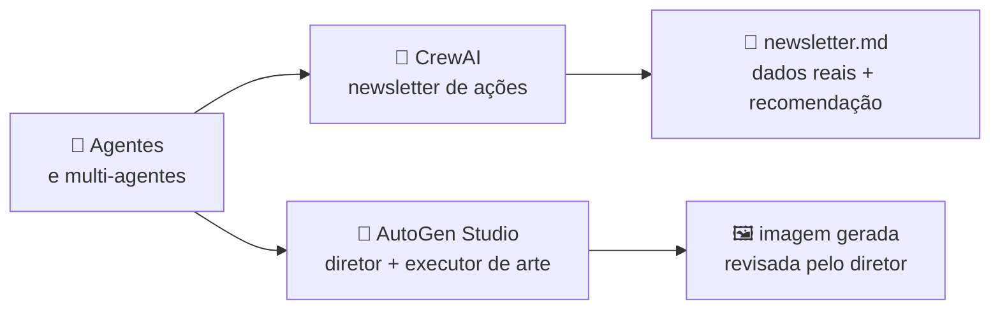

<h1 align="center">🏁 Conclusão</h1>

  
  
  

<h2 align="left">🎯 Objetivo</h2>

Revisar o Nível 8 e comparar as duas abordagens de agentes vistas no módulo.

---

## 🗺️ O caminho do módulo

| Etapa | Aulas | O que ficou |
| :--- | :---: | :--- |
| **Introdução** | 233–236 | Agente = LLM + papel + tools + loop; multi-agentes; frameworks |
| **CrewAI – conceitos** | 237–241 | `Agent`, `Task`, `Crew`, `Process` e `@tool` |
| **CrewAI – projeto** | 242–249 | 5 agentes, `yfinance`, busca de notícias, `output_pydantic`, `context` |
| **AutoGen Studio** | 250–256 | Models, Skills, UserProxy, Group Chat, Playground |

---

## ⚖️ CrewAI x AutoGen

| | CrewAI | AutoGen / Studio |
| :--- | :--- | :--- |
| **Modelo mental** | Equipe com tarefas | Agentes conversando |
| **Fluxo** | Sequencial / hierárquico, previsível | Group chat, mais livre |
| **Interface** | Código | Código **e** visual (Studio) |
| **Melhor para** | Pipelines com etapas bem definidas | Colaboração iterativa, revisão, execução de código |

---

## ⚠️ Boas práticas

- Começar com **um** agente; dividir só quando as etapas forem diferentes.
- Tools devolvem **dados prontos** (cálculos feitos); o LLM interpreta.
- Sempre ter **limite de iterações / mensagens** e condição de término.
- Monitorar **tokens**: multi-agentes multiplicam o custo.
- Saídas estruturadas (`output_pydantic`) tornam o fluxo previsível.

---

## ✅ Resumo

- Agentes resolvem o que o chat puro não resolve: **dados atuais** e **ações**.
- CrewAI para pipelines de equipe; AutoGen para conversas entre agentes.
- O mesmo problema (ex.: análise de ações) fica personalizado, rastreável e automatizável.
