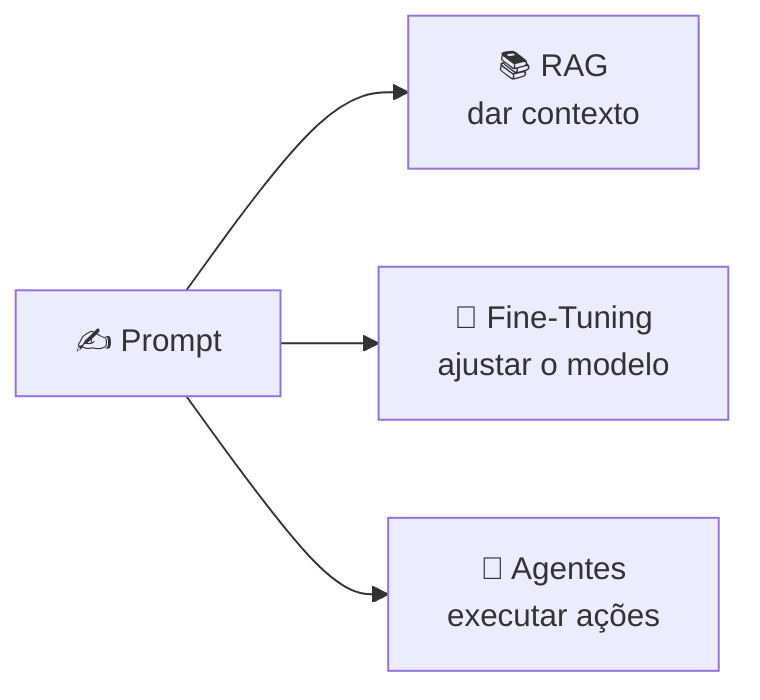

<h1 align="center">🚀 Carreira e uso diário</h1>

<p align="center">
  
  
  
</p>

<h2 align="left">🎯 Objetivo</h2>

Ver onde Prompt Engineering entra no dia a dia e na carreira de quem trabalha com tecnologia.

---

## 🗓️ Uso diário

| Situação | Exemplo de prompt |
| :--- | :--- |
| **Código** | "Explique este erro e sugira a correção mínima: ```...```" |
| **Estudo** | "Me explique RAG como se eu soubesse só Python básico, com 1 exemplo" |
| **Escrita** | "Revise este e-mail: tom profissional, máx. 5 linhas" |
| **Dados** | "Gere a query SQL para... a tabela tem as colunas X, Y, Z" |
| **Planejamento** | "Quebre este projeto em tarefas de até 1 dia" |

---

## 💼 Carreira

- Prompt Engineering virou **habilidade transversal**: dev, produto, dados, marketing.
- Em produtos com LLM, o prompt é **parte do código**: versionado, testado e revisado.
- Combina com o que vimos no ciclo: **RAG** (contexto), **Fine-Tuning** (comportamento) e **Agentes** (ações).



> Regra prática: tente resolver **primeiro com prompt**; só parta para RAG / Fine-Tuning quando o prompt não bastar.

---

## ⚠️ Boas práticas

- Revise sempre a saída: a responsabilidade continua sendo sua.
- Não envie dados sensíveis ou de clientes para ferramentas não aprovadas.
- Guarde os prompts que funcionam (biblioteca pessoal / templates).

---

## ✅ Resumo

- Prompt bem escrito economiza tempo em código, estudo e comunicação.
- É habilidade de carreira, não só de "quem mexe com IA".
- Prompt → RAG → Fine-Tuning → Agentes: do mais simples ao mais complexo.
